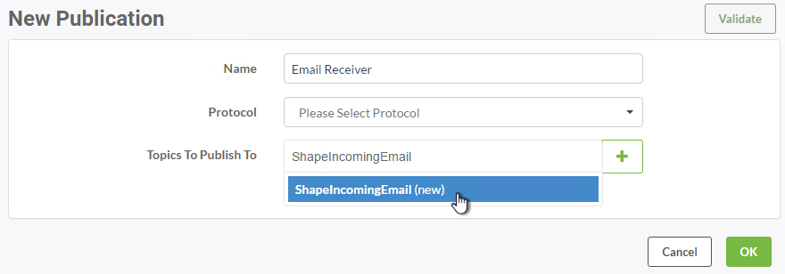
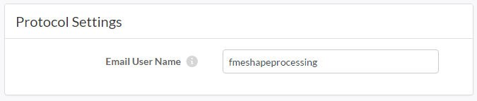
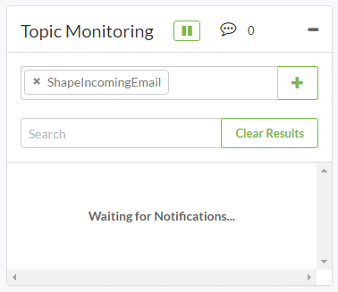
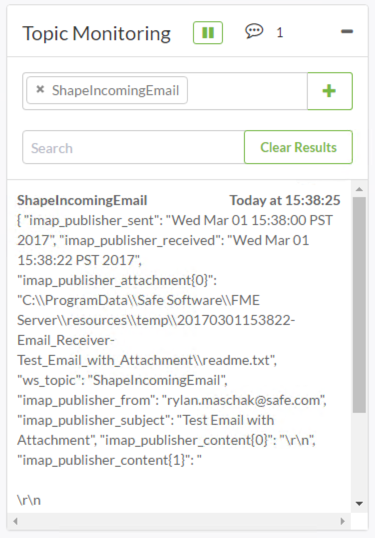
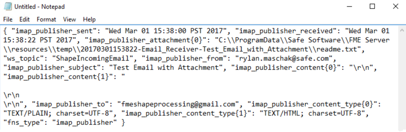
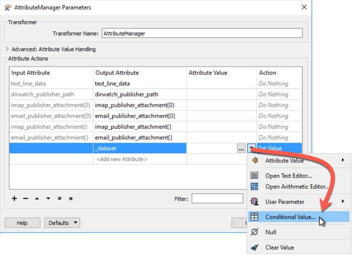
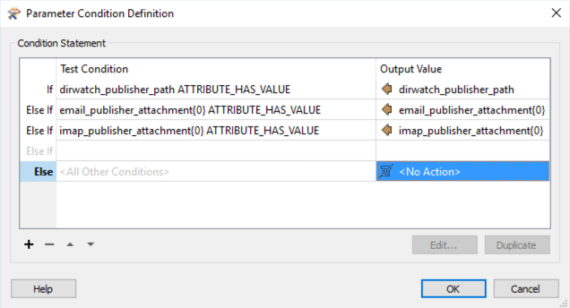
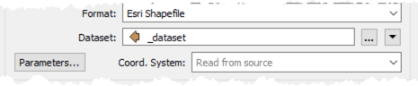
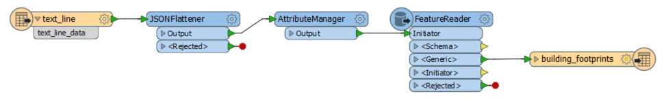

<!--Instructor Notes-->

<!--Exercise Section-->

<table style="border-spacing: 0px;border-collapse: collapse;font-family:serif">
<tr>
<td width=25% style="vertical-align:middle;background-color:darkorange;border: 2px solid darkorange">
<i class="fa fa-cogs fa-lg fa-pull-left fa-fw" style="color:white;padding-right: 12px;vertical-align:text-top"></i>
Exercise 4 (Advanced)
</td>
<td style="border: 2px solid darkorange;background-color:darkorange;color:white">
Building Updates Notification System
</td>
</tr>

<tr>
<td style="border: 1px solid darkorange; font-weight: bold">Data</td>
<td style="border: 1px solid darkorange">Building footprints (Esri Shapefile)</td>
</tr>

<tr>
<td style="border: 1px solid darkorange; font-weight: bold">Overall Goal</td>
<td style="border: 1px solid darkorange">Provide email-driven notifications for updates</td>
</tr>

<tr>
<td style="border: 1px solid darkorange; font-weight: bold">Demonstrates</td>
<td style="border: 1px solid darkorange">Email publications and Notification service</td>
</tr>

<tr>
<td style="border: 1px solid darkorange; font-weight: bold">Start Workspace</td>
<td style="border: 1px solid darkorange">RealTime-Ex4-Begin.fmw</td>
</tr>

<tr>
<td style="border: 1px solid darkorange; font-weight: bold">End Workspace</td>
<td style="border: 1px solid darkorange">RealTime-Ex4-Complete.fmw</td>
</tr>

</table>

---

As a technical analyst in the GIS department you were involved in a recent project to set up a Directory Watch solution for users to automatically update the corporate database. 

Having learned that not all users are able to access the internal network where FME Server is hosted, you think that it should be possible to also set up a system that uses email-based automation to handle the same updates.

---

 **1) Create Topic**
 The first step is to create a Topic that will be triggered by the email. Log in to the FME Server web user interface and navigate to the Notifications page.

Click the Publications tab and then select New.

Enter "Email Receiver" as the Name. Then click in the text box under Topics to Publish To. Type in *ShapeIncomingEmail* and click on it to add. This will create a new Topic and assign it to this Publication. 

The new Publication can be created to use either the Email (SMTP) protocol or the Email (IMAP) protocol. 

SMTP is easier to set up but FME Server must reside on a server with a proper DNS record (all FME Cloud and Training machines will have this). IMAP is necessary when FME Server resides on an internal network.

---

***Email Protocol***

To use the SMTP protocol select Email (SMTP) as the Publication Protocol. This will open the Email User Name parameter. Enter a name for receiving email, for example *fmeshapeprocessing*

Clicking OK will create an email address *fmeshapeprocessing@&lt;hostname&gt;* - for example: 

<table>
<tr><th>Host</th><th>Example Email Address</th></tr>
<tr><td>FME Cloud</td><td>fmeshapeprocessing@myfmeserver.fmecloud.com</td></tr>
<tr><td>Amazon AWS</td><td>fmeshapeprocessing@ec1-23-456-789-012.compute-1.amazonaws.com</td></tr>
</table>

Now all emails sent to that address will trigger the ShapeIncomingEmail topic. 

---

***IMAP Protocol***

To use the IMAP protocol select Email (IMAP) as the Publication Protocol. This will open a number of other parameters. Enter them according to your email account.

In case it is of use, the server information for Gmail, Outlook, and Yahoo! are as follows:

<table style="border: 0px">

<tr>
<td style="font-weight: bold">IMAP Server Host</td>
<td style="">imap.gmail.com</td>
<td style="">imap-mail.outlook.com</td>
<td style="">imap.mail.yahoo.com</td>
</tr>

<tr>
<td style="font-weight: bold">Server Port</td>
<td style="">993</td>
<td style="">993</td>
<td style="">993</td>
</tr>

<tr>
<td style="font-weight: bold">Connection Security</td>
<td style="">SSL</td>
<td style="">SSL</td>
<td style="">SSL</td>
</tr>

<tr>
<td style="font-weight: bold">Verify SSL Certificates</td>
<td style="">Yes</td>
<td style="">Yes</td>
<td style="">Yes</td>
</tr>

</table>

You will also need to check the settings in your email account to make sure IMAP is turned on. Regardless of the email provider, you should set these parameters as follows:

- Poll Interval: 1 minute
- Emails to Fetch: New Emails Only.

Select a Resource Folder for attachments to be saved to and click OK to close the dialog and create the new Publication.

 **2) Test Publication**
 Now let's test the publication. In the Notifications page on FME Server, click the tab marked Topics. Set up Topic Monitoring to watch the topic *ShapeIncomingEmail*:

Now send an email *with an attachment* to the address selected for the new publication. When the email is received by FME Server (SMTP), or FME Server fetches it (IMAP), the topic will be triggered with a message. (Remember that an IMAP publication only checks for an email every 60 seconds, so the result might not be immediate!)

Recall that in the previous exercise you used the Logger Protocol and Logger transformers to record the JSON formatted notification message. The same information is displayed in the Topic Monitoring window - copy this text and place it into a new file for use later in this exercise.

 **3) Update Workspace**
 You already have a created a workspace in FME Workbench to handle incoming notifications from Directory Watch. Let's modify the workflow so that it can work with both Publication protocols. Open the existing workspace C:\FMEData2017\Workspaces\ServerAuthoring\RealTime-Ex4-Begin.fmw in FME Workbench.

Open the JSONFlattener parameters, and add *imap_publisher_attachment{0}* and *email_publisher_attachment{0}* under Attributes to Expose:

You can see these are two of the available attributes that are returned by the Topic Message.

<!--Person X Says Section-->

<table style="border-spacing: 0px">
<tr>
<td style="vertical-align:middle;background-color:darkorange;border: 2px solid darkorange">
<i class="fa fa-quote-left fa-lg fa-pull-left fa-fw" style="color:white;padding-right: 12px;vertical-align:text-top"></i>
Ms Analyst says...
</td>
</tr>

<tr>
<td style="border: 1px solid darkorange">

Adding both imap_publisher_attachment and email_publisher_attachment modifies this workspace so that it can work with both Email (SMTP) and Email (IMAP) Publications!

</td>
</tr>
</table>

 **4) Add AttributeManager**
 The next step is to insert a transformer that will determine where the data is coming from (Directory Watch or an Email Publication) - this is a task where conditional statements are invaluable.

Add an AttributeManager transformer in between the JSONFlattener and FeatureReader. Open the parameters and add *_dataset* as a new Output Attribute. 

Set the Attribute Value as a Conditional Value:

Configure the Conditional Value as follows:

The final step is to change the Dataset in the FeatureReader to point at the new _dataset attribute:

The workflow should now look like this:

 **5) Edit User Parameter** 
 As with Exercise 3, specify the output datatset to be written into the FME Server Resources Folder.

Open the DestDataset_SPATIALITE User Parameter and enter *$(FME_SHAREDRESOURCE_DATA)\/Output\/building_footprints.sl3*:

 **6) Publish Workspace**
 Publish this workspace to FME Server, registering it under the Notification service. When the Notification service is selected, it is highlighted in red indicating its parameters need to be configured. 

Click the "Edit" button and set *ShapeIncomingEmail* for the "Subscribe to Topics" parameter. Set the "Parameter to Get Topic Message" as *Source Text File(s)*:

 **6) Update Directory Watch Subscription (Optional)**
 If you have completed Exercise 3, using the FME Server web user interface you can set the "Process Building Updates" Subscription to point at this new workspace. 

 **7) Test Workspace**
 Test the workspace by sending an email to the Publication email address. Be sure to attach a zip file of the Shapefile datasets (.dbf, .prj, .shp, .shx) from C:\FMEData2017\Data\Engineering\BuildingFootprints to the email.

You can verify if the workflow was successful by checking the Completed Jobs page and the timestamp of the SpatiaLite database in Resources > Output in the FME Server web user interface.

---

<!--Exercise Congratulations Section--> 

<table style="border-spacing: 0px">
<tr>
<td style="vertical-align:middle;background-color:darkorange;border: 2px solid darkorange">
<i class="fa fa-thumbs-o-up fa-lg fa-pull-left fa-fw" style="color:white;padding-right: 12px;vertical-align:text-top"></i>
CONGRATULATIONS
</td>
</tr>

<tr>
<td style="border: 1px solid darkorange">

By completing this exercise you have learned how to:
 
<ul><li>Create an Email Publication</li>
<li>Create a new FME Workspace Subscription as part of the Publishing process</li>
<li>Use incoming email to trigger Topics/Notifications</li>
<li>Configure a workspace to handle triggers by multiple Publication types</li></ul>

</td>
</tr>
</table>   
