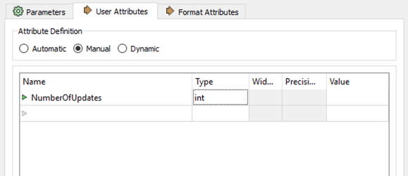
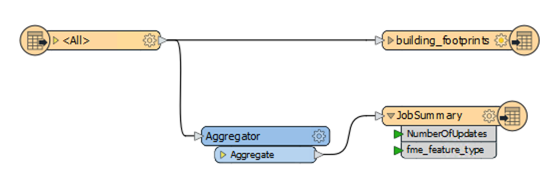
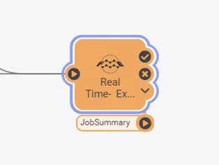
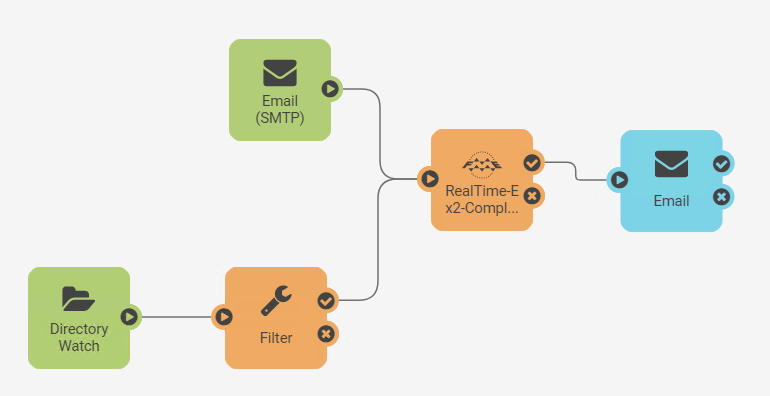
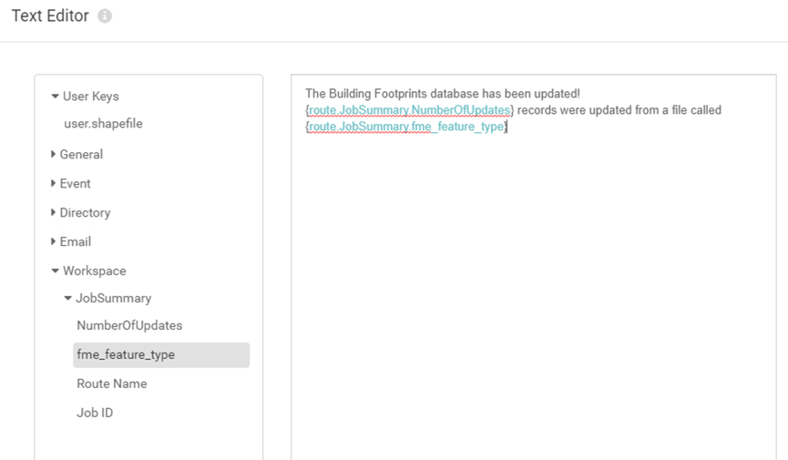
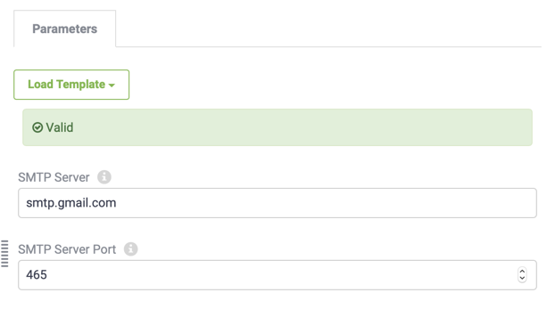
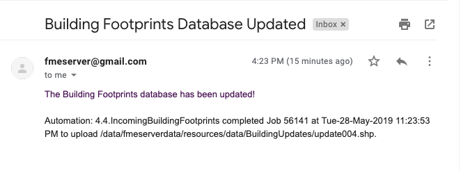

<!--Instructor Notes-->

<!--Exercise Section-->

<table style="border-spacing: 0px;border-collapse: collapse;font-family:serif">
<tr>
<td width=25% style="vertical-align:middle;background-color:darkorange;border: 2px solid darkorange">
<i class="fa fa-cogs fa-lg fa-pull-left fa-fw" style="color:white;padding-right: 12px;vertical-align:text-top"></i>
Exercise 4.4
</td>
<td style="border: 2px solid darkorange;background-color:darkorange;color:white">
Building Updates Automation
</td>
</tr>

<tr>
<td style="border: 1px solid darkorange; font-weight: bold">Data</td>
<td style="border: 1px solid darkorange">Building footprints (Esri Shapefile)</td>
</tr>

<tr>
<td style="border: 1px solid darkorange; font-weight: bold">Overall Goal</td>
<td style="border: 1px solid darkorange">Provide email-driven notifications for updates</td>
</tr>

<tr>
<td style="border: 1px solid darkorange; font-weight: bold">Demonstrates</td>
<td style="border: 1px solid darkorange">Automations Writer and Email Actions</td>
</tr>

<tr>
<td style="border: 1px solid darkorange; font-weight: bold">Start Server Project</td>
<td style="border: 1px solid darkorange">C:\FMEData2020\Projects\ServerAuthoring\RealTime-Ex4-Begin.fsproject
</td>
</tr>

<tr>
<td style="border: 1px solid darkorange; font-weight: bold">End Server Project</td>
<td style="border: 1px solid darkorange">C:\FMEData2020\Projects\ServerAuthoring\RealTime-Ex4-Complete.fsproject</td>
</tr>

</table>

---

After configuring an Automation in FME Server to process building footprint updates with both the Directory Watch and Email Triggers, your supervisor is wondering if they can receive an email whenever the corporate database is updated.

Using an external email server, you think that it is possible to configure the existing Automation in FME Server to satisfy this requirement. You also realize that you can use an Automations Writer in the workspace to include additional information about the updates made to the corporate database in the email that is sent.

---

<!--Person X Says Section-->

<table style="border-spacing: 0px">
<tr>
<td style="vertical-align:middle;background-color:darkorange;border: 2px solid darkorange">
<i class="fa fa-quote-left fa-lg fa-pull-left fa-fw" style="color:white;padding-right: 12px;vertical-align:text-top"></i>
FME Lizard says...
</td>
</tr>

<tr>
<td style="border: 1px solid darkorange">

This exercise continues where <a href="https://s3.amazonaws.com/gitbook/Server-Authoring-2019/ServerAuthoring4RealTime/Exercise3.html
"> Exercise 3 </a> left off. You must have completed Exercise 3 to carry out this exercise.
 Access to an SMTP Email Server is required for sending email in this exercise. Gmail, Outlook, and Yahoo! are examples of acceptable web-based solutions if you do not have access to an internal email server.
</td>
</tr>
</table>

---
 **1) Open Workspace in Workbench**
 If you don't already have the workspace from Exercise 2 open in Workbench, download it from FME Server using the File > Download from FME Server option in Workbench. From the download from FME Server dialog, choose the Training Repository and select RealTime-Ex2-Complete.fmw to open it in Workbench for editing.

 **2) Create Summary Information for Job**
 Now, you are going to update this workspace to generate a summary of the number of records that were updated from the incoming Shapefile. Add an Aggregator transformer and connect it in parallel to the Shapefile Reader like this:

 Open the Aggregator parameters dialog and set the Count Attribute to a name: NumberOfUpdates

 **3) Add Automations Writer**
 Go to Writers > Add Writer and select the FME Server Automations format. Set the Feature Type Definition to Automatic... and add the writer to the canvas. When prompted, set the Feature Type Name to JobSummary and click OK.

Connect the Automations Writer feature type to the output port of the Aggregator transformer.

 **4)Clean up Automations Writer Attributes**
 After connecting the Automations writer, you'll notice that all the attributes from the Shapefile data are included on the writer. We don't need all that information within the Automation. Open the Feature Type Properties on the writer, then go to User Attributes and select Manual under Attribute Definition.

Remove all the attributes except for the one we created earlier, NumberOfUpdates. Set the Type for NumberOfUpdates to int as this is a numeric value.

Click OK to apply that change. At this stage, there should be two attributes on the JobSummary Feature Type: NumberOfUpdates and fme_feature_type

 **5)Save and Republish Workspace**
 Save the workspace and Republish it to FME Server.

 **6)Update Workspace Action**
 Open the FME Server web interface and navigate to the Automations:Manage page. Click the Incoming Building Footprints and stop the Automation to allow for editing. Click on the Workspace Action in the Automation to open its parameters. Click on the Refresh button in the top right of the Parameters window then click Apply to update the Workspace Action. A new output port should appear in the Automation.

 **7) Add External Action**
 The final step in the Automation is to add an email service External Action through which a response will be sent.

Select the plus icon in the bottom left and drag an External Action (blue) to the canvas. Connect this to the JobSummary output port of the Run Workspace node, which will now also act as a Trigger.

Double click on the node to configure it, set the action to send an email and set up your SMTP email server parameters.

In case it is of use, the server information for Gmail is as follows:

<table style="border: 0px">

<tr>
<td style="font-weight: bold">SMTP Server Host</td>
<td style="">smtp.gmail.com</td>
</tr>

<tr>
<td style="font-weight: bold">Server Port</td>
<td style="">465</td>
</tr>

<tr>
<td style="font-weight: bold">Connection Security</td>
<td style="">SSL/TLS</td>
</tr>

</table>

There is also the option to load a template for some other Email Servers, if you are unsure what port/host they use.  Regardless of the email provider, you should set these parameters as follows:

<table style="border: 0px">
<tr>
<td style="font-weight: bold">Email To</td>
<td style="">(An email you have access to check)</td>
</tr>

<tr>
<td style="font-weight: bold">Email From</td>
<td style="">Your account name (for example fmeshapeprocessing@myfmeserver.fmecloud.com)</td>
</tr>

<tr>
<td style="font-weight: bold">Email Subject</td>
<td style="">Building Footprints Database Updated</td>
</tr>

</table>

Next, set the Email Body. Click the drop-down arrow to the right of the value and select Text Editor. This will open a window that will allow you to add content that can also include values coming from elements within the Automation.

Set the Email Body to the following:

The Building Footprints database has been updated!
{route.JobSummary.NumberOfUpdates} records were updated from a file called {route.JobSummary.fme_feature_type}

**Note:** To add the information coming from the Automations Writer, look at the panel on the left-hand side of the Text Editor and look under Workspace > JobSummary for the list of attributes available to use. Click on each one to add them to the text editor.

---

<!--Person X Says Section-->

<table style="border-spacing: 0px">
<tr>
<td style="vertical-align:middle;background-color:darkorange;border: 2px solid darkorange">
<i class="fa fa-quote-left fa-lg fa-pull-left fa-fw" style="color:white;padding-right: 12px;vertical-align:text-top"></i>
FME Lizard says...
</td>
</tr>

<tr>
<td style="border: 1px solid darkorange">

For the Email Body parameter click the drop-down arrow and then select Text Editor. This will open a pop-up window that allows you to write email content that also contains information from elements in the Automation. This might be useful for sending out Notifications to an Administrator on Job failure, where you can include the additional details about the Job, such as ID and Status Message in the email body, and the job log as an attachment.
</td>
</tr>
</table>

---
Before you Apply these parameters validate the Email Server configuration using the Validate button, if FME Server is unable to connect to the email server you can troubleshoot this before finding out after your automation is running.

Enable the Automation by selecting the Start Automation button.

---
<!--Warning Section-->

<table style="border-spacing: 0px">
<tr>
<td style="vertical-align:middle;background-color:darkorange;border: 2px solid darkorange">
<i class="fa fa-exclamation-triangle fa-lg fa-pull-left fa-fw" style="color:white;padding-right: 12px;vertical-align:text-top"></i>
NOTE
</td>
</tr>

<tr>
<td style="border: 1px solid darkorange">

Depending on your Gmail security settings, you may need to create an app-specific password to allow FME Server to log into the account. See this article if you are noticing errors connecting to your account: <a href="https://knowledge.safe.com/articles/394/imap-publisher-not-reading-emails-from-gmail.html">IMAP Publication or Email Subscription is not Reading Emails from Gmail</a>

</td>
</tr>
</table>

---

 **8) Test Automation**
 Test the Automation by either sending an email with a zip file attachment of the Shapefile datasets (.dbf, .prj, .shp, .shx) from C:\FMEData2020\Data\Engineering\BuildingFootprints, or by adding this collection of files to the Directory Watch as in Exercise 1.

If the workflow was successful, you should receive an email back with a response!

---

<!--Exercise Congratulations Section-->

<table style="border-spacing: 0px">
<tr>
<td style="vertical-align:middle;background-color:darkorange;border: 2px solid darkorange">
<i class="fa fa-thumbs-o-up fa-lg fa-pull-left fa-fw" style="color:white;padding-right: 12px;vertical-align:text-top"></i>
CONGRATULATIONS
</td>
</tr>

<tr>
<td style="border: 1px solid darkorange">

By completing this exercise you have learned how to:
 
<ul>
<li>Add an Automations Writer to a workspace</li>
<li>Set up an outgoing Email Action</li>
<li>Trigger an Email notification through Automations</li></ul>

</td>
</tr>
</table>
