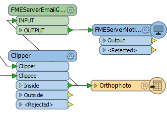
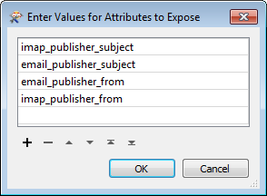
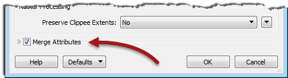
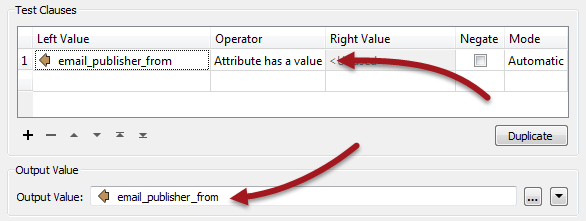
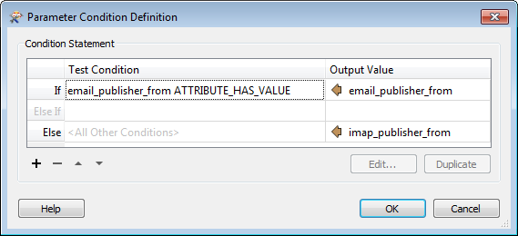
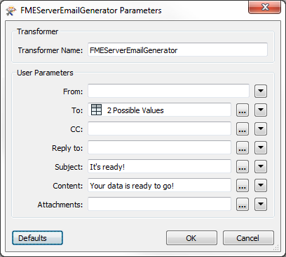
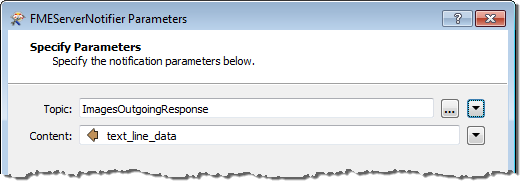

<!--Instructor Notes-->

<!--Exercise Section-->
<!--NB: In GitBook world we don't give a number to exercises-->

<table style="border-spacing: 0px;border-collapse: collapse;font-family:serif">
<tr>
<td width=25% style="vertical-align:middle;background-color:darkorange;border: 2px solid darkorange">
<i class="fa fa-cogs fa-lg fa-pull-left fa-fw" style="color:white;padding-right: 12px;vertical-align:text-top"></i>
Exercise 5
</td>
<td style="border: 2px solid darkorange;background-color:darkorange;color:white">
Orthophoto Notification System
</td>
</tr>

<tr>
<td style="border: 1px solid darkorange; font-weight: bold">Data</td>
<td style="border: 1px solid darkorange">Orthophoto images (GeoTIFF)</td>
</tr>

<tr>
<td style="border: 1px solid darkorange; font-weight: bold">Overall Goal</td>
<td style="border: 1px solid darkorange">Provide email-driven access to orthophoto files</td>
</tr>

<tr>
<td style="border: 1px solid darkorange; font-weight: bold">Demonstrates</td>
<td style="border: 1px solid darkorange">Sending an email response to the user</td>
</tr>

<tr>
<td style="border: 1px solid darkorange; font-weight: bold">Start Workspace</td>
<td style="border: 1px solid darkorange">C:\FMEData2016\Workspaces\ServerAuthoring\Notifications-Ex5-Begin.fmw</td>
</tr>

<tr>
<td style="border: 1px solid darkorange; font-weight: bold">End Workspace</td>
<td style="border: 1px solid darkorange">C:\FMEData2016\Workspaces\ServerAuthoring\Notifications-Ex5-Complete.fmw</td>
</tr>

</table>

---

As a technical analyst in the GIS department you are setting up a solution to deliver raster imagery that is triggered by email. 

So far you have set up a system for incoming email notifications to be registered by FME Server and triggered a workspace to run in response and process the email content. Now let's send a response to the users to let them know their data is ready to download.

---

<!--Person X Says Section-->

<table style="border-spacing: 0px">
<tr>
<td style="vertical-align:middle;background-color:darkorange;border: 2px solid darkorange">
<i class="fa fa-quote-left fa-lg fa-pull-left fa-fw" style="color:white;padding-right: 12px;vertical-align:text-top"></i>
Miss Vector says...
</td>
</tr>

<tr>
<td style="border: 1px solid darkorange">

This exercise continues where exercise 4 left off. You must have completed exercise 4 to carry out this exercise.
</td>
</tr>
</table>

---

 **1) Add Subscription**
 Open the FME Server web interface and navigate to the Notification management page. Click the Subscriptions tab and then click New to create a new Subscription. This will be an email service through which a response will be sent.

Give the subscription a name like Send Image Response and create a new topic for it such as ImagesOutgoingResponse (it's important to use a different topic than the incoming message).

Set the protocol to Email and set up your SMTP email server parameters.

---

<table style="border-spacing: 0px">
<tr>
<td style="vertical-align:middle;background-color:darkorange;border: 2px solid darkorange">
<i class="fa fa-quote-left fa-lg fa-pull-left fa-fw" style="color:white;padding-right: 12px;vertical-align:text-top"></i>
InteropGeek68 says …
</td>
</tr>

<tr>
<td style="border: 1px solid darkorange">

If you don’t have access to an email server, use <strong>fmeimageprocessing@gmail.com</strong> with the password <strong>FMENotifications</strong>.

</td>
</tr>
</table>

---

In case it is of use, the server information for Gmail is as follows:

- SMTP Server: smtp.gmail.com
- SMTP Server Port: 465
- Connection Security: SSL

Regardless of the email provider, you should set these parameters as follows:

- Email From: Your account name (for example fmeimageprocessing@gmail.com)
- Email Subject: "Your Data is Ready"

Most of the general settings (Email To, Email Template, etc.) will be set by the content we are going to provide.  

 **2) Edit Workspace**
 Open the workspace from exercise 4 (or the begin workspace listed above). Add two new transformers - the FMEServerEmailGenerator (a custom transformer) and an FMEServerNotifier - as a separate stream of data:

  

 **3) Edit JSONFlattener**
 To send an email back to the same person who sent the incoming email, we need to expose an attribute with that account name. So, open the properties dialog for the JSONFlattener and in the Attributes to Expose parameter, add *email&#95;publisher&#95;from* and *imap&#95;publisher&#95;from* 

 **4) Edit Clipper**
 We need the exposed attributes in the two transformers we placed earlier, but currently it's unlikely such attributes make it past the Clipper transformer. So, open the Clipper parameters dialog and check the box labelled Merge Attributes:

 **5) Edit FMEServerEmailGenerator**
 Now open the parameters dialog for the FMEServerEmailGenerator. We could just set the To parameter to one of the attributes we've exposed, depending on what incoming protocol we are using. However, a better solution is to set up the workspace to work regardless of protocol.

So, click the drop-down arrow to the right of the To parameter and choose Conditional Value. Double-click the first row (where it says "If") and a dialog will open in which to enter a test condition. Set up a test where *email&#95;publisher&#95;from* "Has Value". Set the output value to the *email&#95;publisher&#95;from* attribute: 

In other words, if *email&#95;publisher&#95;from* has a value then use it for the To field. Click OK to close that dialog.

Now, back in the previous dialog, double-click in the Else &gt; Output Value field and select Attribute &gt; *imap&#95;publisher&#95;from* from the attribute list:

In other words, if *email&#95;publisher&#95;from* has a value then use it for the To field, else use *imap&#95;publisher&#95;from*

Close this dialog and in the other fields of the FMEServerEmailGenerator, enter a Subject and Message (such as "Your Data is Ready"):

Click OK to close the dialog and we have an email ready to send. 

 **6) Edit FMEServerNotifier**
 Now edit the parameters for the FMEServerNotifier transformer. In the first dialog enter the connection parameters. In the second dialog pick the topic created earlier (ImagesOutgoingResponse) and for the content select the attribute text_line_data (this is what was created by the FMEServerEmailGenerator):

  

 **7) Publish to FME Server**
 Publish the workspace to FME Server. You may (or may not) need to also upload the source raster and KML datasets (depending on whether your FME Server can access the files on your authoring system). Simply register the workspace with the Job Submitter service. 

If the workspace you publish has a different name to that in exercise 3, be sure to navigate to the workspace subscription (Process Images Request) and change it to point to the correct workspace.

 **8) Test Workspace**
 Test the workspace by sending an email to the Publication email address. Be sure to make the subject line one of the neighborhoods in Vancouver:

- Downtown
- Fairview
- Kitsilano
- Mount Pleasant
- Strathcona
- West End

You should receive an email in return, alerting you to when your data is ready to collect. If there is no return email, remember to check to ensure the workspace is triggered and run (in the Topic Monitoring and/or Jobs pages) and then look for the output dataset in Resources &gt; Data &gt; Output 

---

<!--Exercise Congratulations Section--> 

<table style="border-spacing: 0px">
<tr>
<td style="vertical-align:middle;background-color:darkorange;border: 2px solid darkorange">
<i class="fa fa-thumbs-o-up fa-lg fa-pull-left fa-fw" style="color:white;padding-right: 12px;vertical-align:text-top"></i>
CONGRATULATIONS
</td>
</tr>

<tr>
<td style="border: 1px solid darkorange">

By completing this exercise you have learned how to:
 
<ul><li>Set up an outgoing email subscription</li>
<li>Set up email content within an FME workspace</li>
<li>Trigger an email subscription through the FMEServerNotifier transformer</li></ul>

</td>
</tr>
</table>   
