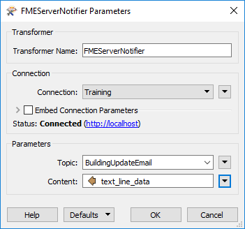
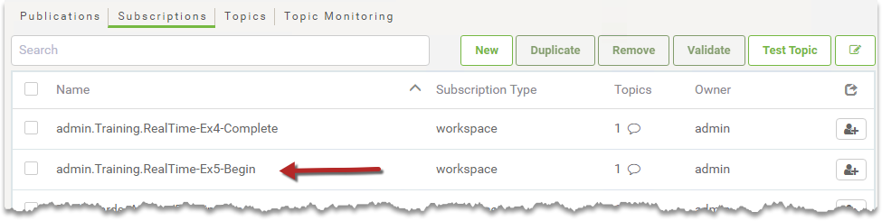

<!--Instructor Notes-->

<!--Exercise Section-->

<table style="border-spacing: 0px;border-collapse: collapse;font-family:serif">
<tr>
<td width=25% style="vertical-align:middle;background-color:darkorange;border: 2px solid darkorange">
<i class="fa fa-cogs fa-lg fa-pull-left fa-fw" style="color:white;padding-right: 12px;vertical-align:text-top"></i>
Exercise 4.5
</td>
<td style="border: 2px solid darkorange;background-color:darkorange;color:white">
Building Updates Notification System
</td>
</tr>

<tr>
<td style="border: 1px solid darkorange; font-weight: bold">Data</td>
<td style="border: 1px solid darkorange">Building footprints (Esri Shapefile)</td>
</tr>

<tr>
<td style="border: 1px solid darkorange; font-weight: bold">Overall Goal</td>
<td style="border: 1px solid darkorange">Provide email-driven notifications for updates</td>
</tr>

<tr>
<td style="border: 1px solid darkorange; font-weight: bold">Demonstrates</td>
<td style="border: 1px solid darkorange">Email subscriptions</td>
</tr>

<tr>
<td style="border: 1px solid darkorange; font-weight: bold">Start Workspace</td>
<td style="border: 1px solid darkorange">C:\FMEData2018\Workspaces\ServerAuthoring\RealTime-Ex5-Begin.fmw</td>
</tr>

<tr>
<td style="border: 1px solid darkorange; font-weight: bold">End Workspace</td>
<td style="border: 1px solid darkorange">C:\FMEData2018\Workspaces\ServerAuthoring\RealTime-Ex5-Complete.fmw</td>
</tr>

</table>

---

After configuring FME Server to process building footprints updates with both the Directory Watch and Email Publications, your supervisor is wondering if they can receive an email whenever the corporate database is updated.

Using an external email server, you think that it is possible to configure another Notification in FME Server to satisfy this requirement.

---

<!--Person X Says Section-->

<table style="border-spacing: 0px">
<tr>
<td style="vertical-align:middle;background-color:darkorange;border: 2px solid darkorange">
<i class="fa fa-quote-left fa-lg fa-pull-left fa-fw" style="color:white;padding-right: 12px;vertical-align:text-top"></i>
Miss Vector says...
</td>
</tr>

<tr>
<td style="border: 1px solid darkorange">

This exercise continues where Exercise 4 left off. You must have completed Exercise 4 to carry out this exercise.
 Access to an SMTP Email Server is required for sending email in this exercise. Gmail, Outlook, and Yahoo! are examples acceptable web-based solutions if you do not have access to an internal email server.
</td>
</tr>
</table>

---

 **1) Add Subscription**
 Open the FME Server web interface and navigate to the Notifications page. Click the Subscriptions tab and then click New to create a new Subscription. This will be an email service through which a response will be sent.

Give the subscription a name like *Send Building Update Email* and create a new topic for it such as *BuildingUpdateEmail* (it's important to use a different topic than from the previous exercises).

Set the protocol to Email and set up your SMTP email server parameters.

In case it is of use, the server information for Gmail is as follows:

<table style="border: 0px">

<tr>
<td style="font-weight: bold">SMTP Server Host</td>
<td style="">smtp.gmail.com</td>
</tr>

<tr>
<td style="font-weight: bold">Server Port</td>
<td style="">465</td>
</tr>

<tr>
<td style="font-weight: bold">Connection Security</td>
<td style="">SSL/TLS</td>
</tr>

</table>

Regardless of the email provider, you should set these parameters as follows:

<table style="border: 0px">

<tr>
<td style="font-weight: bold">Email From</td>
<td style="">Your account name (for example fmeshapeprocessing@gmail.com)</td>
</tr>

<tr>
<td style="font-weight: bold">Email Subject</td>
<td style="">Building Footprints Database Updated</td>
</tr>

</table>

Most of the general settings (Email To, Email Template, etc.) will be set by the content we are going to provide, so once the above is set, click OK to save the Subscription.

<!--Warning Section-->

<table style="border-spacing: 0px">
<tr>
<td style="vertical-align:middle;background-color:darkorange;border: 2px solid darkorange">
<i class="fa fa-exclamation-triangle fa-lg fa-pull-left fa-fw" style="color:white;padding-right: 12px;vertical-align:text-top"></i>
NOTE
</td>
</tr>

<tr>
<td style="border: 1px solid darkorange">

Depending on your Gmail security settings, you may need to create an app-specific password to allow FME Server to log into the account. See this article if you are noticing errors connecting to your account: <a href="https://knowledge.safe.com/articles/394/imap-publisher-not-reading-emails-from-gmail.html">IMAP Publication or Email Subscription is not Reading Emails from Gmail</a>
 Alternatively, if you do not have access to an email account, change the Protocol for this subscription to 'Logger' instead. This will add an entry into one of the FME Server logfiles when the BuildingUpdateEmail topic is triggered.

</td>
</tr>
</table>

---

 **2) Edit Workspace**
 Open the workspace from Exercise 4 (or the Start Workspace listed above).

Add two new transformers - the [FMEServerEmailGenerator](https://hub.safe.com/transformers/fmeserveremailgenerator) (a custom transformer) and an FMEServerNotifier - as a separate stream of data, connected to the <Initiator\> Output Port of the FeatureReader:

***NB:*** *It's important to connect these two transformers to the &lt;Initiator&gt; port of the FeatureReader, where only one feature will emerge. If you connect them to the &lt;Generic&gt; output port then you will get an email for every feature in the Shapefile dataset!*

 **3) Edit FMEServerEmailGenerator**
 Inspect the parameters for the FMEServerEmailGenerator. This transformer can be used to override the configurations in the Email Subscription created in Step 1.

Each field can also accept attributes allowing the email to be dynamically configured. For our purposes in the training course, set the following parameters manually:

<table style="border: 0px">

<tr>
<td style="font-weight: bold">To</td>
<td style="">(An email you have access to check)</td>
</tr>

<tr>
<td style="font-weight: bold">Subject</td>
<td style="">Building Footprints Database Updated</td>

</tr>

<tr>
<td style="font-weight: bold">Content</td>
<td style="">The Building Footprints database has been updated!</td>
</tr>

</table>

 **4) Inspect FMEServerEmailGenerator Output**
 The FMEServerEmailGenerator creates a new attribute called *text&#95;line&#95;data*. Connect an Inspector transformer to the FMEServerEmailGenerator and run the workspace to take a look at the content of that attribute.

You'll see it creates a JSON string like this:
 `{ "email_to" : "fmeservertraining@safe.com","email_cc" : "", "email_bcc" : "", "email_from" : "", "email_replyto" : "", "email_subject" : "Building Footprints Database Updated", "subscriber_content" : "The Building Footprints database has been updated!" }`

Each of the keywords that have values set(such as email_to, email_subject, and subscriber_content) will then override the settings inside the Email Subscription we created. This would allow us to dynamically change parts of the email that is sent based on what happens inside the workspace.

 **5) Edit FMEServerNotifier**
 Now edit the parameters for the FMEServerNotifier transformer.

Set FME Server Connection parameters, pick the Topic created earlier (BuildingUpdateEmail), and for the Content select the attribute *text&#95;line&#95;data* (this attribute is created by the FMEServerEmailGenerator):

 **6) Publish Workspace**
 Save and publish the workspace.

You can either update the published workspace or rename it. 

In FME Server, navigate to the FME Workspace Subscriptions page. Notice that a Subscription will have been automatically created when registering the workspace with the Notification Service in the previous exercise. For example, if the workspace was called RealTime-Ex4, the Subscription name will be something like admin.Training.RealTime-Ex44:

Click on this notification to change its parameters, and set/ensure that the Workspace parameter is pointing to the workspace just published.

 **7) Test Workspace**
 Test the workspace by sending an email to the Publication email address. Be sure to attach a zip file of the Shapefile datasets (.dbf, .prj, .shp, .shx) from C:\FMEData2018\Data\Engineering\BuildingFootprints to the email.

If the workflow was successful, you should receive an email back with a response!

---

<!--Exercise Congratulations Section-->

<table style="border-spacing: 0px">
<tr>
<td style="vertical-align:middle;background-color:darkorange;border: 2px solid darkorange">
<i class="fa fa-thumbs-o-up fa-lg fa-pull-left fa-fw" style="color:white;padding-right: 12px;vertical-align:text-top"></i>
CONGRATULATIONS
</td>
</tr>

<tr>
<td style="border: 1px solid darkorange">

By completing this exercise you have learned how to:
 
<ul><li>Set up an outgoing Email Subscription</li>
<li>Trigger an Email Subscription through the FMEServerNotifier transformer</li></ul>

</td>
</tr>
</table>   
