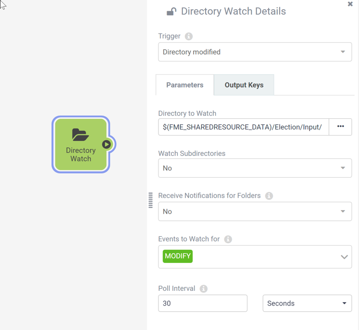
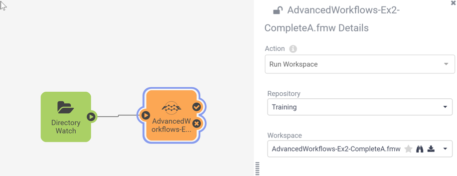
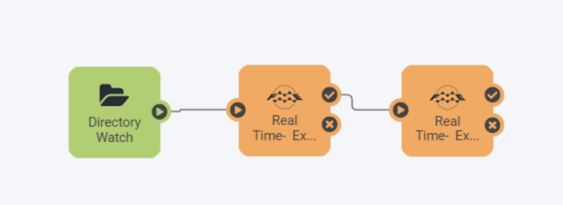

<!--Instructor Notes-->

<!--Exercise Section-->

<table style="border-spacing: 0px;border-collapse: collapse;font-family:serif">
<tr>
<td width=25% style="vertical-align:middle;background-color:darkorange;border: 2px solid darkorange">
<i class="fa fa-cogs fa-lg fa-pull-left fa-fw" style="color:white;padding-right: 12px;vertical-align:text-top"></i>
Exercise 6.3
</td>
<td style="border: 2px solid darkorange;background-color:darkorange;color:white">
Authoring Workspace Chains in Automations
</td>
</tr>

<tr>
<td style="border: 1px solid darkorange; font-weight: bold">Data</td>
<td style="border: 1px solid darkorange">Voting Divisions (GML (Geography Markup Language)) Addresses (Esri Geodatabase (File Geodb API))</td>
</tr>

<tr>
<td style="border: 1px solid darkorange; font-weight: bold">Overall Goal</td>
<td style="border: 1px solid darkorange">Create an Automation to chain the previous two translations together</td>
</tr>

<tr>
<td style="border: 1px solid darkorange; font-weight: bold">Demonstrates</td>
<td style="border: 1px solid darkorange">Authoring workspace chains using Automations</td>
</tr>

<tr>
<td style="border: 1px solid darkorange; font-weight: bold">Start Workspace</td>
<td style="border: 1px solid darkorange">None</td>
</tr>

<tr>
<td style="border: 1px solid darkorange; font-weight: bold">End Workspace</td>
<td style="border: 1px solid darkorange">None</td>
</tr>

</table>

---

You have just finished creating a workspace that uses the FMEServerJobSubmitter transformer to chain two workspaces together so that they run consecutively. Now the team has requested you to update this workflow so that they can easily re-run it automatically whenever they update the Election Voting GML file.

You know you can set up an automation to automatically run the parent workspace you created before, but then you'd have both the automation and that parent workspace to update if anything in this workflow changes. You realize that you can handle the job chaining within an Automation as well.

---

 **1) Create Automation**
 In the FME Server interface, navigate to the Automations > Build page to start building a new Automation.

Save the Automation first and give it a name such as JobChaining.

 **2) Add Trigger**
 You want these jobs to start running whenever new data is added, so set up a Trigger to handle that.

Click on the Trigger that is already placed in your Automation to configure it. Set the Trigger as follows:

<table style="border: 0px">

<tr>
<th style="font-weight: bold">Parameter</th>
<th style="">Value</th>
</tr>

<tr>
<td style="font-weight: bold">Trigger</td>
<td style="">Directory Modified</td>
</tr>

<tr>
<td style="font-weight: bold">Directory to Watch</td>
<td style="">Data > Election > Input</td>
</tr>

<tr>
<td style="font-weight: bold">Events to Watch for</td>
<td style="">MODIFY</td>
</tr>

<tr>
<td style="font-weight: bold">Directory to Watch</td>
<td style="">Poll Interval</td>
</tr>

<tr>
<td style="font-weight: bold">Events to Watch for</td>
<td style="">30 Seconds</td>
</tr>

</table>

<!--Warning Section-->

<table style="border-spacing: 0px">
<tr>
<td style="vertical-align:middle;background-color:darkorange;border: 2px solid darkorange">
<i class="fa fa-exclamation-triangle fa-lg fa-pull-left fa-fw" style="color:white;padding-right: 12px;vertical-align:text-top"></i>
WARNING
</td>
</tr>

<tr>
<td style="border: 1px solid darkorange">

We're setting the Poll Interval here to 30 seconds just to make testing faster for the purposes of training. For regular use, we'd recommend using minutes as the minimum interval.
 If you end up with many Automations all set to poll every few seconds, it could take a toll on system performance.

</td>
</tr>
</table>

 **3) Add Workspace Action**
 Now we want to add an Action to run the first of the two workspaces we want to run in our job chain.

Click on the + button and drag an Action onto the canvas. Connect it to the Directory Watch Trigger and configure it as follows:

<table style="border: 0px">

<tr>
<td style="font-weight: bold">Action</td>
<td style="">Run Workspace</td>
</tr>

<tr>
<td style="font-weight: bold">Repository</td>
<td style="">Training</td>
</tr>

<tr>
<td style="font-weight: bold">Workspace</td>
<td style="">AdvancedWorkflows-Ex2-CompleteA.fmw</td>
</tr>

</table>

 **4) Add Second Workspace Action**
 Notice that unlike the FMEServerJobSubmitter, the Workspace Action does not have an option for wait for job to complete. This is because a Workspace Action will always wait until the job has completed before moving onto the next Action within the Automation.

To set up the second workspace to run, simply add a second Action and connect it to the checkmark (or Action Succeeded) port on the Workspace Action we just added. Configure this one to run the AdvancedWorkflows-Ex2-CompleteB.fmw from inside the Training repository.

Your final Automation should look like this:

 **5) Save and Start Automation**
 Save your Automation. Then click the Start Automation button to start the Automation.

 **6) Test the Automation**
  Now you can the Automation by uploading a modified version of the ElectionVoting.gml file to Resources.

Open the Resources page and navigate to Data > Election > Input. Click on Upload > Files and select the following two files to upload:

- C:\FMEData2019\Resources\ServerAuthoring\JobChaining\ElectionVoting.gml
- C:\FMEData2019\Resources\ServerAuthoring\JobChaining\ElectionVoting.xsd

Wait a minute or so and then View Triggered Jobs for your Automation, you should see that both chained workspaces successfully ran in order.

<!--Exercise Congratulations Section-->

<table style="border-spacing: 0px">
<tr>
<td style="vertical-align:middle;background-color:darkorange;border: 2px solid darkorange">
<i class="fa fa-thumbs-o-up fa-lg fa-pull-left fa-fw" style="color:white;padding-right: 12px;vertical-align:text-top"></i>
CONGRATULATIONS
</td>
</tr>

<tr>
<td style="border: 1px solid darkorange">

By completing this exercise you have learned how to:
 
<ul><li>Create a Job Chain within an FME Server Automation to run jobs in sequence</li>
</ul>

</td>
</tr>
</table>
