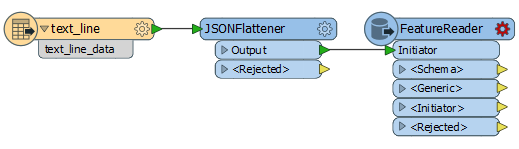
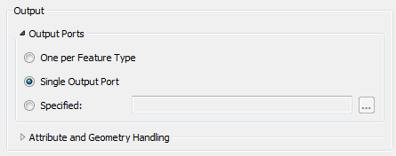
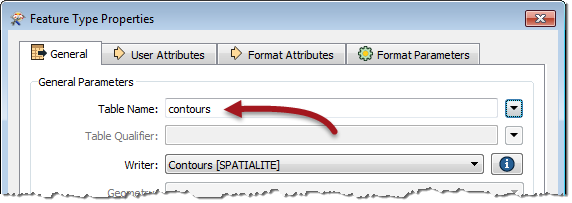
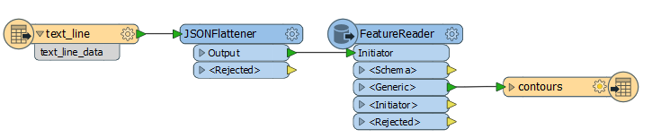
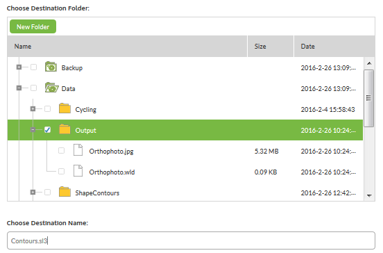
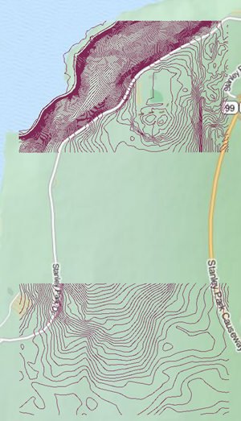

<!--Instructor Notes-->

<!--Exercise Section-->
<!--NB: In GitBook world we don't give a number to exercises-->

<table style="border-spacing: 0px;border-collapse: collapse;font-family:serif">
<tr>
<td width=25% style="vertical-align:middle;background-color:darkorange;border: 2px solid darkorange">
<i class="fa fa-cogs fa-lg fa-pull-left fa-fw" style="color:white;padding-right: 12px;vertical-align:text-top"></i>
Exercise 6
</td>
<td style="border: 2px solid darkorange;background-color:darkorange;color:white">
Shape Dataset Processing
</td>
</tr>

<tr>
<td style="border: 1px solid darkorange; font-weight: bold">Data</td>
<td style="border: 1px solid darkorange">Contour Datasets (Esri Shapefile)</td>
</tr>

<tr>
<td style="border: 1px solid darkorange; font-weight: bold">Overall Goal</td>
<td style="border: 1px solid darkorange">Trigger notification for new files</td>
</tr>

<tr>
<td style="border: 1px solid darkorange; font-weight: bold">Demonstrates</td>
<td style="border: 1px solid darkorange">Processing Directory Watch notifications</td>
</tr>

<tr>
<td style="border: 1px solid darkorange; font-weight: bold">Start Workspace</td>
<td style="border: 1px solid darkorange">None</td>
</tr>

<tr>
<td style="border: 1px solid darkorange; font-weight: bold">End Workspace</td>
<td style="border: 1px solid darkorange">C:\FMEData2016\Workspaces\ServerAuthoring\Notifications-Ex6-Complete.fmw</td>
</tr>

</table>

---

Having carried out various notification tasks, your mind goes back to a Directory Watch project you started but didn't finish. It involved watching for Shape datasets representing contours. Let's see if we can put that start to a good use. 

---

<!--Person X Says Section-->

<table style="border-spacing: 0px">
<tr>
<td style="vertical-align:middle;background-color:darkorange;border: 2px solid darkorange">
<i class="fa fa-quote-left fa-lg fa-pull-left fa-fw" style="color:white;padding-right: 12px;vertical-align:text-top"></i>
Miss Vector says...
</td>
</tr>

<tr>
<td style="border: 1px solid darkorange">

This exercise continues where exercise 1 left off. You must have completed exercise 1 to carry out this exercise.
</td>
</tr>
</table>

---

 **1) Create Workspace**
 Start Workbench and begin with an empty workspace. 

Select Readers &gt; Add Reader from the menubar. When prompted set the parameters as follows: 

<table style="border: 0px">

<tr>
<td style="font-weight: bold">Reader Format</td>
<td style="">Text File</td>
</tr>

<tr>
<td style="font-weight: bold">Reader Dataset</td>
<td style="">C:\FMEData2016\readme.txt</td>
</tr>

<tr>
<td style="font-weight: bold">Reader Parameters</td>
<td style="">Read Whole File at Once: Yes</td>
</tr>

</table>

As you know by now, it doesn't really matter what text file we use as the source, it won't be used anyway. It will be replaced by the content of the incoming message.

 **2) Add JSONFlattener**
 Now add a JSONFlattener transformer to the workspace, after the Text File Reader:

Open the parameters dialog. In there select *text&#95;line&#95;data* as the source of the JSON content. Under Attributes to Expose manually enter *dirwatch_publisher_content*

Add Logger transformers after the JSONFlattener

 **3) Publish to FME Server**
 Publish the workspace to FME Server, registering it under the Job Submitter service. 

 **4) Create Subscription**
 Now log in to the FME Server web interface and navigate to Manage &gt; Notifications. 

Click on the Subscriptions tab and click New to create a new Subscription.

Call the subscription "Process Incoming Shape".  Subscribe to the topic ShapeIncomingFile

Now set the protocol to Workspace and select the workspace uploaded in the previous step. Under Notification Message Mapping, select the published parameter for the Text File Reader source dataset.

Click OK to create the Subscription.

 **5) Test Topic**
 Locate the source Shape datasets in C:\FMEData2016\Data\ElevationModel\Contours - select a set of Shape files (.dbf, .prj, .shp, .shx) and create a zip file out of them (as you did in Exercise 1).

Copy the zip file into the newly created Resources folder. You can do this through the file system (by copying the file to C:\ProgramData\Safe Software\FME Server\resources\data\ShapeContours) or using the web interface. 

 **6) Check Results**
 Now Navigate to Manage &gt; Jobs. Under completed jobs should be the workspace you just caused to run. View or download the log file and look for the logged feature. You should find it has an attribute containing JSON, and a number of attributes extracted from the JSON. 

<table>
<tr><td>dirwatch_publisher_action</td><td>CREATE</td></tr>
<tr><td>dirwatch_publisher_content</td><td>ENTRY_CREATE C:\ProgramData\Safe Software\FME Server\resources\data\ShapeContours\K11.zip</td></tr>
<tr><td>dirwatch_publisher_path</td><td>C:\ProgramData\Safe Software\FME Server\resources\data\ShapeContours\K11.zip</td></tr>
</table>

So now we know what the data looks like and can process it accordingly.

 **7) Edit JSONFlattener Transformer**
 Back in FME Workbench open the JSONFlattener transformer parameters. Under Attribute to Expose add the attribute dirwatch&#95;publisher&#95;path

 **8) Add FeatureReader Transformer**
 Now add a FeatureReader transformer in place of the Loggers:

This is a transformer that will let us read the contents of the dataset. Open the parameters dialog. Set:

<table>
<tr><td><strong>Reader Format</strong></td><td>Esri Shapefile</td></tr>
<tr><td><strong>Reader Dataset</strong></td><td>Select Attribute Value &gt; dirwatch&#95;publisher&#95;path</td></tr>
<tr><td><strong>Output Port</strong></td><td>Single Output Port</td></tr>
</table>

Click OK to close the dialog. You may receive a warning message, but it can be ignored.

 **9) Add Writer**
 Having read the data from Shape, we can now add it to our corporate database.

Select Writers &gt; Add Writer from the menubar. When prompted set the parameters as follows: 

<table style="border: 0px">

<tr>
<td style="font-weight: bold">Writer Format</td>
<td style="">SpatiaLite</td>
</tr>

<tr>
<td style="font-weight: bold">Writer Dataset</td>
<td style="">C:\FMEData2016\Output\Contours.sl3</td>
</tr>

<tr>
<td style="font-weight: bold">Writer Parameters</td>
<td style="">Overwrite Existing Database: No Drop Existing Tables: No</td>
</tr>

<tr>
<td style="font-weight: bold">Add Feature Types</td>
<td style="">Table Definition: Manual</td>
</tr>

</table>

In the new feature type that is created, simply change the name to *contours*:

Click OK to close the dialog and connect the new feature type to the FeatureReader transformer's &lt;Generic&gt; output port:

 **10) Republish Workspace**
 Publish the workspace back to FME Server

 **11) Adjust Subscription**
 Navigate to Manage &gt; Notifications and open the Process Incoming Shape Subscription for editing. The settings should now include one for the output database. Change it to write the database in the Resources folder:

Don't - for fairly obvious reasons - write it back to the same folder as the incoming Shape data!

 **12) Test Solution**
 Now test the solution by putting more zipped Shape data into the directory watch folder. You will find that each dataset put into the folder is added to the SpatiaLite database:

---

<!--Exercise Congratulations Section--> 

<table style="border-spacing: 0px">
<tr>
<td style="vertical-align:middle;background-color:darkorange;border: 2px solid darkorange">
<i class="fa fa-thumbs-o-up fa-lg fa-pull-left fa-fw" style="color:white;padding-right: 12px;vertical-align:text-top"></i>
CONGRATULATIONS
</td>
</tr>

<tr>
<td style="border: 1px solid darkorange">

By completing this exercise you have learned how to:
 
<ul><li>Use Loggers to identify what JSON attributes an incoming message provides</li>
<li>Use a FeatureReader transformer to read the data added to a Directory Watch folder</li></ul>

</td>
</tr>
</table>   
