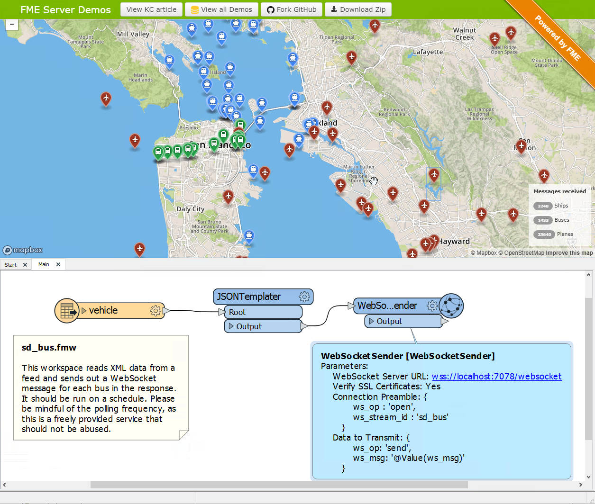

# Message Streaming #

Message streaming is a real-time technique like Automations. However, where Automations receive/send one-off messages, message streaming involves a continuous flow of information. This [example from the FME Server Playground](https://community.safe.com/s/article/live-spatial-dashboard) shows a (simulated) live feed of buses, airplanes, and boats in the San Francisco Bay area:

Instead of a workflow being run once for each message, handling a message stream involves creating a workspace that will connect to the stream and run continuously receiving messages as soon as they are sent. Because of this reduced overhead, this technique can process data at a much faster rate than Automations. For our purposes, “continuous” means that messages arrive at the FME Server at a faster rate than Automations could handle; say more than one message per second.

## Why Use a Message Stream? ##

When a workspace is involved as an action for processing messages, Automations operates by starting and running the workspace on demand, in response to an incoming trigger.

However, problems occur when the average message interval is less than the time taken for the Automation to start and run a workspace. A message interval of one second or less is the threshold at which the Automations service starts to struggle.

In a message stream, the workspace used for message processing is constantly running and doesn’t need to be started each time. Because of this reduced overhead, it can process data at a much faster rate than Automations.

When used in this way, we call it high capacity message streaming, as thousands of messages can be processed every second.
