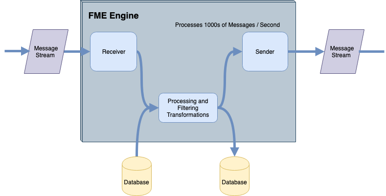

## Message Streaming Architecture ##

A message streaming architecture that both receives and sends messages looks like this:

- A stream of messages is read into the workspace via one of the available transformers, for example, the JMSReceiver
- Each message is processed by any of the available FME transformers, according to the needs of the project
- A stream of messages is sent out of the workspace via one of the available transformers, for example, the TCPIPSender

Although the diagram shows a continuous process, it is not necessary for all of these components to be used in a setup. If the system is required to only receive messages, then only a Receiver transformer is needed. Likewise, if the system is intended to only send messages, then only a Sender transformer is required.

If both receiving and sending messages is required, then all components are necessary. However, it's still possible to split those actions up across several workspaces.

---

### Databases ###
The Database components in this diagram are optional but are very useful. Messages will usually need to be processed against some other datasets (for example overlaid against a geofence), and a database is the quickest solution for reading and writing data.

Data read from a database is intended to be used to process the incoming message. For example, perhaps the message represents a point feature (maybe a vehicle location) that is used to filter against database data (maybe traffic conditions).

Data written to the database is usually to record a stream of message information. For example, perhaps each incoming message represents a point feature (a lightning strike) that needs to be written to a database for a historical record.
