<!--Instructor Notes-->

<!--Exercise Section-->


<table style="border-spacing: 0px;border-collapse: collapse;font-family:serif">
<tr>
<td width=25% style="vertical-align:middle;background-color:darkorange;border: 2px solid darkorange">
<i class="fa fa-cogs fa-lg fa-pull-left fa-fw" style="color:white;padding-right: 12px;vertical-align:text-top"></i>
<span style="color:white;font-size:x-large;font-weight: bold">Exercise 5.1</span>
</td>
<td style="border: 2px solid darkorange;background-color:darkorange;color:white">
<span style="color:white;font-size:x-large;font-weight: bold">Message Streaming: Handling Emergency Phone Call Streams</span>
</td>
</tr>

<tr>
<td style="border: 1px solid darkorange; font-weight: bold">Data</td>
<td style="border: 1px solid darkorange">Event Messages (JSON)</td>
</tr>

<tr>
<td style="border: 1px solid darkorange; font-weight: bold">Overall Goal</td>
<td style="border: 1px solid darkorange">Create a workspace to read, parse, and filter WebSocket messages; keeping only events that affect transit stations.</td>
</tr>

<tr>
<td style="border: 1px solid darkorange; font-weight: bold">Demonstrates</td>
<td style="border: 1px solid darkorange">Creating a workspace to handle a message stream</td>
</tr>

<tr>
<td style="border: 1px solid darkorange; font-weight: bold">Start Workspace</td>
<td style="border: 1px solid darkorange">C:\FMEData2020\Workspaces\ServerAuthoring\DataStream-Ex1-Begin.fmw</td>
</tr>

<tr>
<td style="border: 1px solid darkorange; font-weight: bold">End Workspace</td>
<td style="border: 1px solid darkorange">C:\FMEData2020\Workspaces\ServerAuthoring\DataStream-Ex1-Generate-Complete.fmw<br>C:\FMEData2020\Workspaces\ServerAuthoring\DataStream-Ex1-Process-Complete.fmw</td>
</tr>

</table>

---

As a technical analyst in the GIS department, you deal with spatial data. Sometimes you need to process that data in real-time, and sometimes that data can arrive in significant quantities and at high speed.

In one such case, the city has been given access to real-time information about emergency calls.

*By emergency calls we mean the equivalent of 911 calls in North America, 999 in the UK, 112 in most of Europe, and 000 in Australia.*

Of course, these calls can arrive at a tremendous rate and at unknown intervals. If the city wishes to respond to any of these, and even if they wish to just record a history of the calls, you must implement a message streaming setup in FME Server.

---

<br>**1) Open Workspace**
<br>We don't have access to a real-time stream of emergency phone calls for this training course, so we will have to generate our own.

Open the workspace C:\FMEData2020\Workspaces\ServerAuthoring\DataStream-Ex1-Begin.fmw

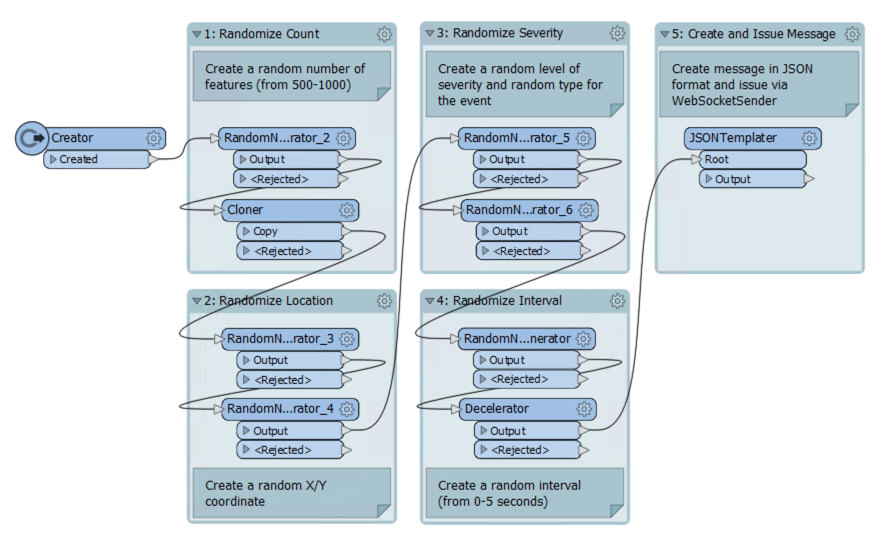

---

Notice that the workspace generates a stream of events. A random number of events are generated, at random times, and at random locations. Additionally, random severity and event type attributes are generated.

Each event is wrapped up into a JSON format message. All that we need to do is push that message out as a stream.

---

<!--Person X Says Section-->

<table style="border-spacing: 0px">
<tr>
<td style="vertical-align:middle;background-color:darkorange;border: 2px solid darkorange">
<i class="fa fa-quote-left fa-lg fa-pull-left fa-fw" style="color:white;padding-right: 12px;vertical-align:text-top"></i>
<span style="color:white;font-size:x-large;font-weight: bold;font-family:serif">FME Lizard says...</span>
</td>
</tr>

<tr>
<td style="border: 1px solid darkorange">
<span style="font-family:serif; font-style:italic; font-size:larger">
This workspace is just generating "events". Those events could be lightning strikes, vehicle locations, traffic accidents, or even UFO sightings! For this exercise, we'll pretend they are emergency phone calls. In real life you would be connecting to an existing stream of data and wouldn't need to generate one in this way.
</span>
</td>
</tr>
</table>

---

<br>**2) Add WebSocketSender Transformer**
<br>Connect a WebSocketSender transformer to the output port of the JSONTemplater. Inspect the parameters and set them as follows:

<table>
<tr><td>WebSocket Server URL</td><td>ws://localhost:7078</td></tr>
<tr><td>Verify SSL Certificates</td><td>No</td></tr>
<tr><td>Connection Preamble</td>
<td>
<pre>
{
    ws_op: "open",
    ws_stream_id: "EmergencyEvents"
}
</pre>
</td></tr>
<tr><td>Data To Transmit</td><td>
<pre>
{
    ws_op: "send",
    ws_msg: @Value(EventMessage)
}
</pre>
</td></tr>

</table>

As you can see, these parameters open a WebSocket connection (to an EmergencyEvents stream) and send information (the EventMessage attribute). Save the parameters and then save the workspace.

<table style="border-spacing: 0px">
<tr>
<td style="vertical-align:middle;background-color:darkorange;border: 2px solid darkorange">
<i class="fa fa-info-circle fa-lg fa-pull-left fa-fw" style="color:white;padding-right: 12px;vertical-align:text-top"></i>
<span style="color:white;font-size:x-large;font-weight: bold;font-family:serif">TIP</span>
</td>
</tr>

<tr>
<td style="border: 1px solid darkorange">
<span style="font-family:serif; font-style:italic; font-size:larger">
Note that the Data To Transmit parameter uses @Value() instead of fme_get_attribute(), which is what will appear if you use the FME Feature Attributes drop-down to construct the JSON. Make sure you use @Value().
</span>
</td>
</tr>
</table>

<br>**3) Create Workspace**
<br>Now we have the ability to generate a stream of data we will create the workspace that is to process the data. Start FME Workbench and begin with a blank canvas (don't close the stream generator workspace, as we'll need that as well in a moment).

In the blank canvas add a Creator transformer and follow it with a WebSocketReceiver. Inspect the WebSocketReceiver transformer parameters and set them as follows:

<table>
<tr><td>WebSocket Server URL</td><td>ws://localhost:7078</td></tr>
<tr><td>Verify SSL Certificates</td><td>No</td></tr>
<tr><td>Connection Preamble</td><td>
<pre>
{
    ws_op: "open",
    ws_stream_id: "EmergencyEvents"
}
</pre>
</td></tr>
<tr><td>Output Attribute</td><td>IncomingMessage</td></tr>

</table>

Save the changes and add a Logger transformer after the WebSocketReceiver.

<br>**4) Publish Workspaces**
<br>Let's test what we have by publishing the workspaces and running them on FME Server.

Publish each workspace in turn. In both cases register it with the Job Submitter service. There are no datasets or other parameters we need to worry about.


<br>**5) Run Workspace**
<br>Log in to the FME Server web interface, locate the data stream generator workspace, and run it. The dialog in response will look like this:

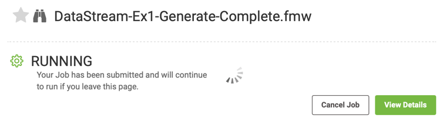

The workspace will run for a long time, and we can leave it to do so. Leave this page by clicking the Run Workspace button on the main menu and - within the Run Workspace page - locate the processing workspace. Now run that.

Again the response will report that the workspace is running, and will continue to do so.


<br>**6) Check Jobs and Cancel**
<br>Navigate to the Jobs page and click the tab labeled Running. You will see the two jobs:

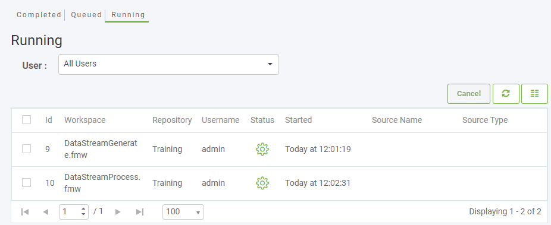

Let the jobs run for a minute or two. Then choose each of them and click the Cancel button to cancel them:

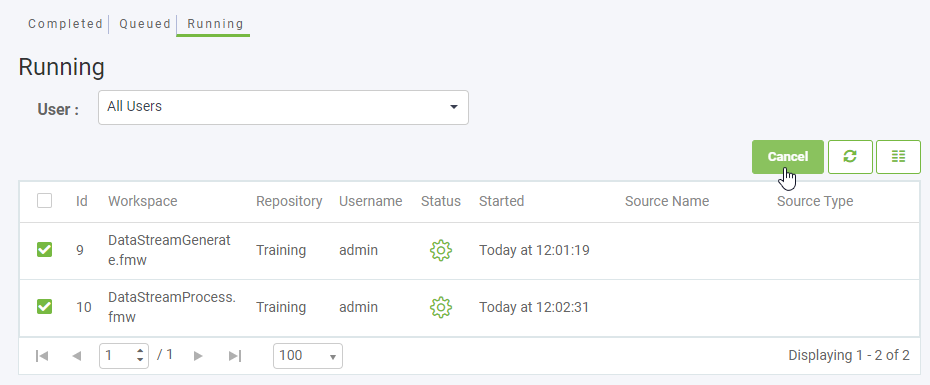

Once canceled, go to the Completed jobs tab. You'll see the two canceled jobs:

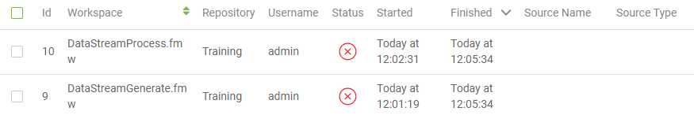

Click on the processing workspace job and check the log. You should see messages in the log like this:

<pre>
|===========================================================================
INFORM|WebSocketReceiver_Output: Feature is:
INFORM|+++++++++++++++++++++++++++++++++++++++++++++++++++++++++++++++++
INFORM|Feature Type: 'WebSocketReceiver_Output_LOGGED'
INFORM|Attribute(encoded: utf-8): 'IncomingMessage' has value '{ "EventID" : 6.....
INFORM|Attribute(string)        : 'fme_geometry' has value 'fme_undefined'
INFORM|Attribute(encoded: utf-8): 'fme_type' has value 'fme_no_geom'
INFORM|Geometry Type: Unknown (0)
</pre>

These messages from the Logger prove that the WebSocketReceiver is acting as expected and receiving messages from the message stream.

---

<!--Person X Says Section-->

<table style="border-spacing: 0px">
<tr>
<td style="vertical-align:middle;background-color:darkorange;border: 2px solid darkorange">
<i class="fa fa-quote-left fa-lg fa-pull-left fa-fw" style="color:white;padding-right: 12px;vertical-align:text-top"></i>
<span style="color:white;font-size:x-large;font-weight: bold;font-family:serif">FME Lizard says...</span>
</td>
</tr>

<tr>
<td style="border: 1px solid darkorange">
<span style="font-family:serif; font-style:italic; font-size:larger">
You've proved that you can create a workspace to process a message stream, which is the important part of this exercise. But if you have the time, let's see what improvements we can add to make the result more realistic.
</span>
</td>
</tr>
</table>

---

<br>**7) Add JSONFlattener**
<br>The first thing to do with incoming messages is to extract information as attributes. Because the incoming data is JSON format, add a JSONFlattener transformer to the processing workspace, replacing the Logger after the WebSocketReceiver.

Inspect the JSONFlattener's parameters and set the attribute IncomingMessage as the JSON Document to process.

Under Attributes to Expose manually enter:

- EventID
- EventLocation.EventXCoord
- EventLocation.EventYCoord
- EventSeverity
- EventType

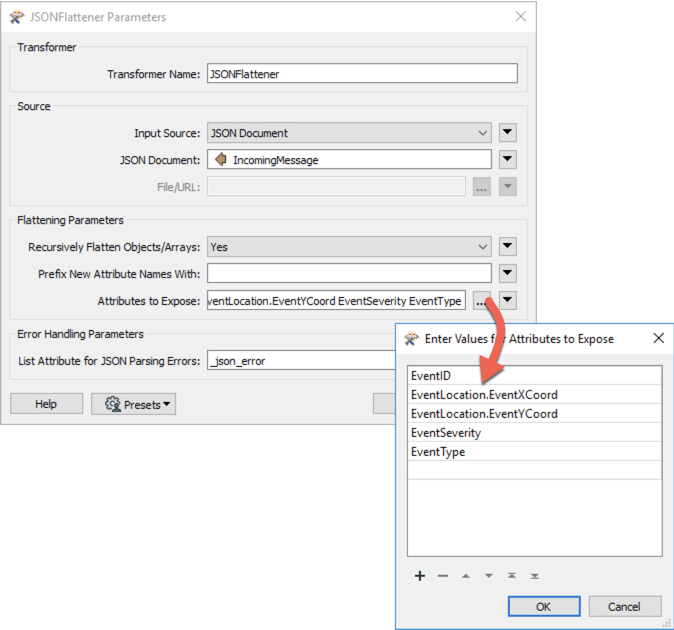

You will now have the information from the message available as a set of attributes in the workspace.


<br>**8) Add VertexCreator**
<br>Now add a VertexCreator transformer. Set it up to use the X/Y attributes to create a true point feature:

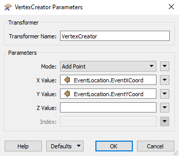

With this, we now have a true geographic feature and can process it as required.


<br>**9) Add Reader**
<br>The public transportation team within the city has learned you are working with this emergency data. They wish to be alerted immediately if there is an emergency event within 200 meters of a transit station. Let's show them how easy it is to set this up.

Firstly we need the transit station data, so select Readers &gt; Add Reader and add the following:

<table style="border: 0px">

<tr>
<td style="font-weight: bold">Reader Format</td>
<td style="">Esri Geodatabase (File Geodb Open API)</td>
</tr>

<tr>
<td style="font-weight: bold">Reader Dataset</td>
<td style="">C:\FMEData2020\Data\CommunityMapping\CommunityMap.gdb</td>
</tr>

</table>

When prompted (or in the parameters dialog) ensure that only the TransitStations table is selected.


<br>**10) Filter Data**
<br>Now let's filter the emergencies.

First, add a Bufferer transformer to the TransitStation feature type and buffer the features by 200 meters. Be sure to set the End Cap Style and Corner Style parameters to Round.

Secondly, add a PointOnAreaOverlayer to assess whether an emergency falls inside one of these buffers. The workspace will now look like this:

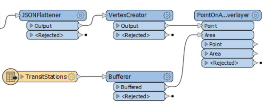

At the moment there is one big problem that stops this from working. The PointOnAreaOverlayer transformer is a Group-Based transformer, sometimes called a "blocker." It will hold on to features until it has finished being fed them, before outputting any data. In our case we want to make it Feature-Based; i.e., it will process each message at once.

So, inspect the PointOnAreaOverlayer parameters and set Areas First to Yes:


This tells the transformer that all area features (buffered stations) will be first to arrive; therefore any point features (message locations) can be processed immediately.

However, we have to ensure that the transit features will arrive first. Therefore inspect the transformer parameters for the Creator transformer and set Create at End to Yes:


Now, all being well, the transit features will arrive first at the PointOnAreaOverlayer transformer.

Finally, add a Tester transformer after the PointOnAreaOverlayer. Set up the test to check for &#95;overlaps &gt; 0 (i.e. where the message location falls inside a transit station buffer). Connect some Logger transformers to the Tester output ports and name them Tester_Passed and Tester_Failed:

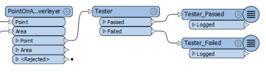

Note that, if there were other parameters (for example the transit team were only interested in Event Types 7, 8, 9, and 10) you could add them to this Tester as well.


<br>**11) Publish Workspaces**
<br>Now publish the two workspaces again (you may or may not have to upload the TransitStation Geodatabase along with the workspace) and run them using the same process as before, but leave it for a few minutes longer, as it can take a while for one of the random events to fall inside a transit station buffer.

Once stopped, check the logs and you should see that messages falling within 200 meters of a transit station are logged under the Tester_Passed header (you can use Ctrl+F to search for them, but note that the log might go to multiple pages).

---

<!--Person X Says Section-->

<table style="border-spacing: 0px">
<tr>
<td style="vertical-align:middle;background-color:darkorange;border: 2px solid darkorange">
<i class="fa fa-quote-left fa-lg fa-pull-left fa-fw" style="color:white;padding-right: 12px;vertical-align:text-top"></i>
<span style="color:white;font-size:x-large;font-weight: bold;font-family:serif">FME Lizard says...</span>
</td>
</tr>

<tr>
<td style="border: 1px solid darkorange">
<span style="font-family:serif; font-style:italic; font-size:larger">
If you want to adjust the settings to get a result quicker, then go ahead. For example, you might set the buffer size to 500 meters instead of 200, or you might reduce the interval time on the message generator. Feel free to make whatever parameter changes you like to test the setup. You could even bypass the Decelerator transformer (in the data-stream creation workspace) to see how fast FME can deal with the incoming messages! However, if you do that, be sure to start the processing workspace first, else the generator might finish by the time you do get the processor started!
</span>
</td>
</tr>
</table>

---

<br>**12) Add Writer**
<br>The messages that are being received are not all being used by the transit team, but we should probably keep a record of them. So - back in the processing workspace in FME Workbench - select Writers &gt; Add Writer from the menubar. Use the following parameters to add a database Writer:

<table style="border: 0px">

<tr>
<td style="font-weight: bold">Writer Format</td>
<td style="">SpatiaLite</td>
</tr>

<tr>
<td style="font-weight: bold">Writer Dataset</td>
<td style="">C:\FMEData2020\Output\Training\EventMessages.sl3</td>
</tr>

<tr>
<td style="font-weight: bold">Writer Parameters</td>
<td style="">Advanced : Features Per Transaction = 1</td>
</tr>

<tr>
<td style="font-weight: bold">Add Feature Type(s)</td>
<td style="">Table Definition: Automatic</td>
</tr>

</table>

In the newly added feature type, change the name to *events* and close the dialog. Connect the feature type to the VertexCreator output port (i.e. we're recording all events, not just the filtered ones):

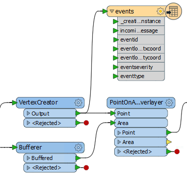

The attributes are added automatically but include a few we don't need. So open up the properties dialog again for the feature type and click the User Attributes tab. Change it from Automatic to Manual and delete the attributes:

- &#95;creation&#95;instance
- incomingmessage
- eventlocation_eventxcoord
- eventlocation_eventycoord


Notice that the attributes were automatically renamed (to lower case and removing disallowed characters) to match SpatiaLite requirements.

If you publish and run the workspace (you may need to set the SpatiaLite database output to be written to a Resources folder) now you should be able to see - while the workspace is still running - the results being added to the database. You can inspect the file in the FME Data Inspector to prove this.


<br>**13) Create Automation**
<br>The filtered messages are important to the transit team, but at the moment they are going nowhere. We should set up a way to inform them.

We could add another messaging transformer, such as the WebSocketSender, JMSSender, SQSConnector, or even a Tweeter. That would make the processing workspace a "pure" messaging workspace.

On the other hand, the outgoing messages are nothing like the same rate as the incoming messages. With the parameters as described in this exercise, there is only a transit message once every minute. So, we can create a "hybrid" solution by setting output messages to be sent via Automations.

Go to the FME Server web interface and navigate to the Automations: Build page.

Add an FME Server Topic Notified Trigger to the canvas and create a new Topic called EmergencyTransitMessages:

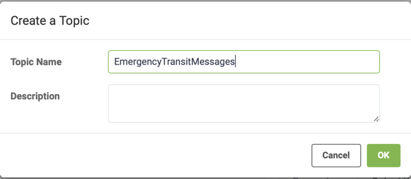

Now add a Log action connected to that topic. There are various protocols we could realistically use for sending a message (email springs to mind) but for the purposes of this exercise use the "Log a message" action is appropriate. Set the Formatted Message using the drop-down menu to Event as JSON (under the Event sub-menu). Then start the Automation.

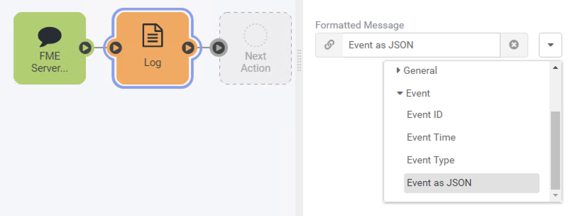

<br>**14) Add FMEServerNotifier Transformer**
<br>Back in the processing workspace in FME Workbench, remove any Logger transformers at the end of the workspace. Add an FMEServerNotifier transformer connected to the Tester:Passed port:

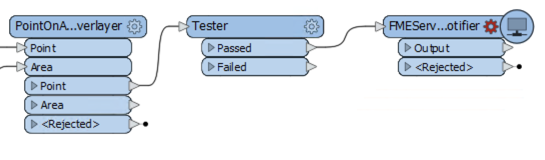

Inspect the transformer parameters and set it up to send a message to the EmergencyTransitMessages topic. Set the message content to be whatever you like. You could use the text editor dialog to create something out of the available attributes (it can be plain text, it doesn't have to be JSON or XML).


<br>**15) Publish and Run Workspaces**
<br>Re-publish and set the workspaces running again. Navigate to View Log File under the Menu drop-down in your Automation to find the results as recorded by the Log Action. An event should look something like this in the log:

```json
{"automation.id":"88893f75-5895-4855-a1bf-e1975d2719c5","EventSeverity":"5.2","EventType":"8","EventLocation":"{\"EventYCoord\":\"5458573.607\",\"EventXCoord\":\"491851.971\"}","EventID":"33","time":"2020-08-06T14:52:40-07:00","source":"topic","event.id":"b6e9d57b-424c-49b4-a02b-e169343ab6f8","automation.name":"EmergencyTransitMessages"}
```

---

<!--Exercise Congratulations Section-->

<table style="border-spacing: 0px">
<tr>
<td style="vertical-align:middle;background-color:darkorange;border: 2px solid darkorange">
<i class="fa fa-thumbs-o-up fa-lg fa-pull-left fa-fw" style="color:white;padding-right: 12px;vertical-align:text-top"></i>
<span style="color:white;font-size:x-large;font-weight: bold;font-family:serif">CONGRATULATIONS</span>
</td>
</tr>

<tr>
<td style="border: 1px solid darkorange">
<span style="font-family:serif; font-style:italic; font-size:larger">
By completing this exercise you have learned how to:
<br>
<ul><li>Send and receive messages via WebSockets</li>
<li>Publish and run message-streaming workspaces</li>
<li>Cancel message-streaming workspaces and check their log files</li>
<li>Extract attributes from JSON messages</li>
<li>Use transformers to transform and filter a message according to its content</li>
<li>Set up workspaces to handle group-based transformers in a real-time scenario</li>
<li>Record incoming messages into a database</li>
<li>Set up a hybrid system with message streaming <strong>and</strong> automations</li></ul>
</span>
</td>
</tr>
</table>
