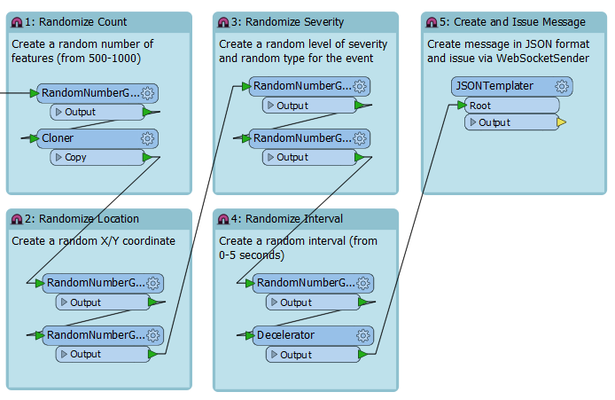
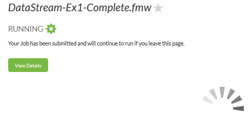
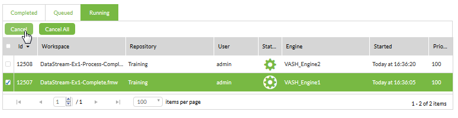

<!--Instructor Notes-->

<!--Exercise Section-->
<!--NB: In GitBook world we don't give a number to exercises-->

<table style="border-spacing: 0px;border-collapse: collapse;font-family:serif">
<tr>
<td width=25% style="vertical-align:middle;background-color:darkorange;border: 2px solid darkorange">
<i class="fa fa-cogs fa-lg fa-pull-left fa-fw" style="color:white;padding-right: 12px;vertical-align:text-top"></i>
Exercise 1
</td>
<td style="border: 2px solid darkorange;background-color:darkorange;color:white">

</td>
</tr>

<tr>
<td style="border: 1px solid darkorange; font-weight: bold">Data</td>
<td style="border: 1px solid darkorange">Event Messages (JSON)</td>
</tr>

<tr>
<td style="border: 1px solid darkorange; font-weight: bold">Overall Goal</td>
<td style="border: 1px solid darkorange">Create a workspace to read WebSocket messages</td>
</tr>

<tr>
<td style="border: 1px solid darkorange; font-weight: bold">Demonstrates</td>
<td style="border: 1px solid darkorange">Creating a workspace to handle a message stream</td>
</tr>

<tr>
<td style="border: 1px solid darkorange; font-weight: bold">Start Workspace</td>
<td style="border: 1px solid darkorange">C:\FMEData2016\Workspaces\ServerAuthoring\DataStream-Ex1-begin.fmw</td>
</tr>

<tr>
<td style="border: 1px solid darkorange; font-weight: bold">End Workspace</td>
<td style="border: 1px solid darkorange">C:\FMEData2016\Workspaces\ServerAuthoring\DataStream-Ex1-Complete.fmw C:\FMEData2016\Workspaces\ServerAuthoring\DataStream-Ex1-Process-Complete.fmw</td>
</tr>

</table>

---

As a technical analyst in the GIS department you deal with spatial data. Sometimes you need to process that data in real-time and sometimes that data can arrive in great quantities and at great speed.

The city has been given access to the monitoring systems of emergency services. That means the ability to access in real-time information about all emergency calls. 

*By emergency calls we mean the equivalent of 911 calls in North America, 999 in the UK, 112 in most of Europe, and 000 in Australia.* 

Of course, these calls can arrive at a tremendous rate, and at unknown intervals. If the city wishes to respond to any of these, and even if they wish to just record a history of the calls, you must implement a message streaming setup in FME Server. 

---

 **1) Open Workspace**
 Unfortunately (I'm talking from a training point of view) we don't have access to a real-time stream of emergency phone calls, so we will have to generate our own.

Open the workspace C:\FMEData2016\Workspaces\ServerAuthoring\DataStream-Ex1-begin.fmw

Notice that the workspace generates a stream of events. A random number of events are generated, at random times, and at random locations. Additionally random severity and event type attributes are generated. 

Each event is wrapped up into a JSON format message. All that we need to do is push that message out as a stream.

---

<!--Person X Says Section-->

<table style="border-spacing: 0px">
<tr>
<td style="vertical-align:middle;background-color:darkorange;border: 2px solid darkorange">
<i class="fa fa-quote-left fa-lg fa-pull-left fa-fw" style="color:white;padding-right: 12px;vertical-align:text-top"></i>
Miss Vector says...
</td>
</tr>

<tr>
<td style="border: 1px solid darkorange">

This workspace is just generating "events". Those events could be lightning strikes, vehicle locations, traffic accidents, or even UFO sightings! For this exercise, we'll pretend they are emergency phone calls. In real life you would be connecting to an existing stream of data, and wouldn't need to generate one in this way. 

</td>
</tr>
</table>

---

 **2) Add WebSocketSender Transformer**
 Add a WebSocketSender transformer after the JSONTemplater. Open the parameters dialog. Set the parameters as follows:

<table>
<tr><td>WebSocket Server URL</td><td>ws://localhost:7078</td></tr>
<tr><td>Verify SSL Certificates</td><td>No</td></tr>
<tr><td>Connection Preamble</td><td>
<pre>
{
    ws_op: "open",
    ws_stream_id: "EmergencyEvents"
}
</pre>
</td></tr>
<tr><td>Data To Transmit</td><td>
<pre>
{
    ws_op: 'send',
    ws_msg: '@Value(EventMessage)'
}
</pre>
</td></tr>

</table>

Click OK to close the parameters dialog and then save the workspace.

 **3) Create Workspace**
 Now we have the ability to generate a stream of data we will create the workspace that is to process the data. Start Workbench and begin with a blank canvas (don't close the stream generator workspace, as we'll need that as well in a moment). 

In the blank canvas add a Creator transformer and follow it with a WebSocketReceiver. Open the WebSocketReceiver's parameters dialog. Set the parameters as follows:

<table>
<tr><td>WebSocket Server URL</td><td>ws://localhost:7078</td></tr>
<tr><td>Verify SSL Certificates</td><td>No</td></tr>
<tr><td>Connection Preamble</td><td>
<pre>
{
    ws_op: "open",
    ws_stream_id: "EmergencyEvents"
}
</pre>
</td></tr>
<tr><td>Output Attribute</td><td>IncomingMessage</td></tr>

</table>

Close the dialog and add a Logger transformer after the WebSocketSender.

 **4) Publish Workspaces**
 Let's test what we have by publishing the workspaces and running them on FME Server. 

Publish each workspace in turn. In both cases simply register it with the Job Submitter service. There are no datasets or other parameters we need worry about.

 **5) Run Workspace**
 Log in to FME Server, locate the data stream generator workspace, and run it. The dialog in response will look like this:

The workspace will run for a long time and we can leave it to do so. Click the Home button and locate the processing workspace. Now run that.

Again the workspace will run as report that it will continue to do so.

 **6) Check Jobs and Cancel**
 From the menu select Manage Jobs and click the tab labelled Running. You will see the two jobs:

Let the jobs run for a minute or two. Then choose each of them and click the Cancel button to cancel them:

Once cancelled, go to the Completed jobs tab. You'll see the two cancelled jobs:

Click on the processing workspace job and check the log. You should see messages in the log like this:

<pre>
|===========================================================================
INFORM|WebSocketReceiver_Output: Feature is:
INFORM|+++++++++++++++++++++++++++++++++++++++++++++++++++++++++++++++++
INFORM|Feature Type: `WebSocketReceiver_Output_LOGGED'
INFORM|Attribute(encoded: utf-8): `IncomingMessage' has value `{ "EventID" : 6.....
INFORM|Attribute(string)        : `fme_geometry' has value `fme_undefined'
INFORM|Attribute(encoded: utf-8): `fme_type' has value `fme_no_geom'
INFORM|Geometry Type: Unknown (0)
</pre>

This proves that the WebSocketReceiver is acting as expected and receiving messages from the message stream.

---

<!--Exercise Congratulations Section--> 

<table style="border-spacing: 0px">
<tr>
<td style="vertical-align:middle;background-color:darkorange;border: 2px solid darkorange">
<i class="fa fa-thumbs-o-up fa-lg fa-pull-left fa-fw" style="color:white;padding-right: 12px;vertical-align:text-top"></i>
CONGRATULATIONS
</td>
</tr>

<tr>
<td style="border: 1px solid darkorange">

By completing this exercise you have learned how to:
 
<ul><li>Create a workspace to read and write raster data</li>
<li>Publish and run a workspace using the Data Download service</li></ul>

</td>
</tr>
</table>   

