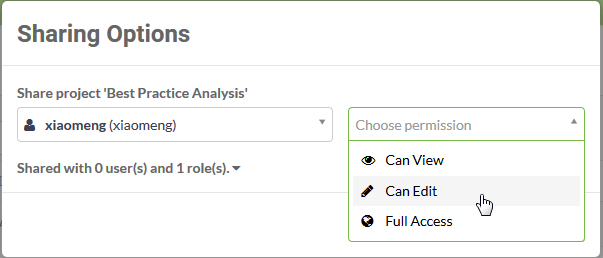

# Sharing a Project

A project is often carried out by a group of FME users and authors, therefore it makes sense that a Project is able to be shared among multiple FME users.

## Share Project ##

Sharing a project is carried out on the Projects page (accessed via the main menu) by simply clicking the Share with Others button for the Project to be shared:

You don't even need to select the Project first.

The Share with Others tool works the same way as the tool for sharing a repository: it opens a pop-up dialog in which to select a user and choose the level of permission that you wish to give to them:

Remember, FME Security is based on users and roles. Roles are analogous to a group of users. When sharing a Project, the "user" field can be an individual user, or it can be applied to a particular role; for example you can give the ability to view your project to anyone in the *fmeuser* role.

Sharing a Project gives the ability to access not just repositories and workspaces, but all of the components related to that Project.

---

<!--Person X Says Section-->

<table style="border-spacing: 0px">
<tr>
<td style="vertical-align:middle;background-color:darkorange;border: 2px solid darkorange">
<i class="fa fa-quote-left fa-lg fa-pull-left fa-fw" style="color:white;padding-right: 12px;vertical-align:text-top"></i>
Miss Vector says...
</td>
</tr>

<tr>
<td style="border: 1px solid darkorange">

A Project can be shared only in the following circumstances:
  1. You must own the Project. Only the Project owner can share it.
 2. You must be a user with permission to manage security. Only such a user can share a Project.
 3. You can own the Project OR be a user with permission to manage security (i.e. you can be one or the other).
 4. You own the Project AND you are a user with permission to manage security (i.e. you must be both).

</td>
</tr>
</table>
