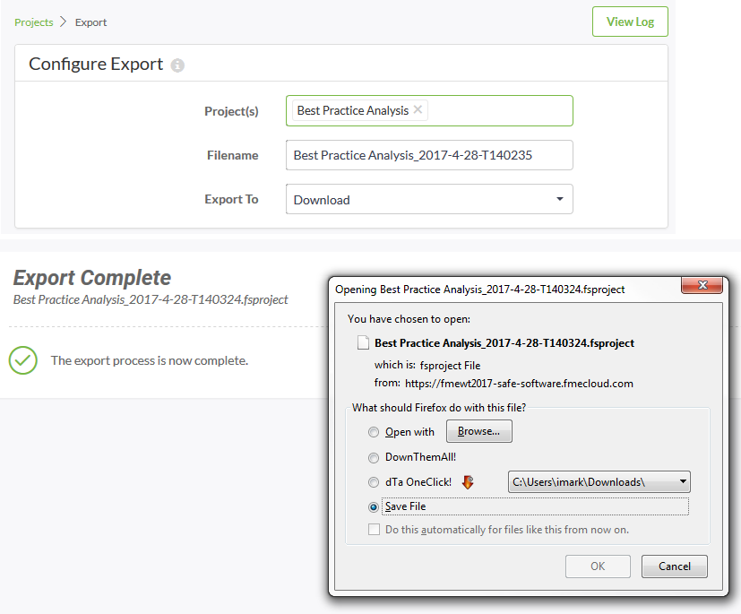

# Managing Projects

One of the key uses for a Project is in transferring a set of FME Server components from one Server instance to another. This is carried out by using the Export and Import tools. There is also a tool for Removing a Project from a system. 

## Exporting a Project ##

Exporting a project is carried out on the Projects page (accessed via the main menu) by selecting the Project to be exported and clicking the Export button:

This opens a dialog in which to configure and carry out the export:

The export writes to a file with a .fsproject extension. There is an option to either provide the export as a download, or to write it to a Resources folder.

