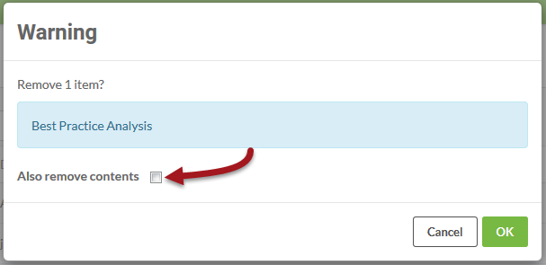

## Removing a Project ##

Once a Project has been exported, you may wish to remove it from the server instance on which it currently resides. That can be done by selecting the Project and clicking the Remove button.

The confirmation dialog that opens allows you to choose whether to also delete all of the components that make up the Project:

