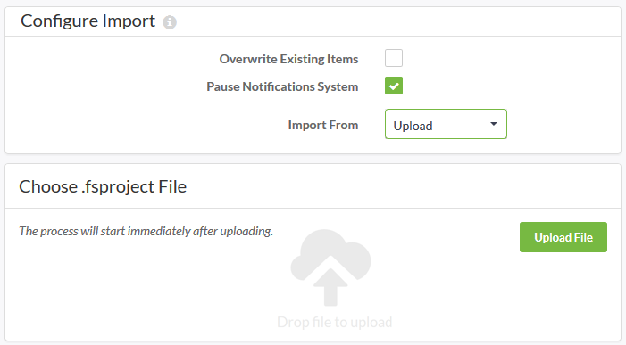

## Importing a Project ##

Importing a project is - like exporting - carried out on the Projects page; this time by simply clicking the Import button.

The Import page allows an fsproject file to be uploaded or read from a Resources folder. It also includes other parameters to control the import:

