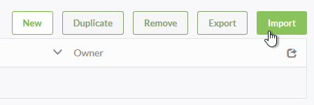
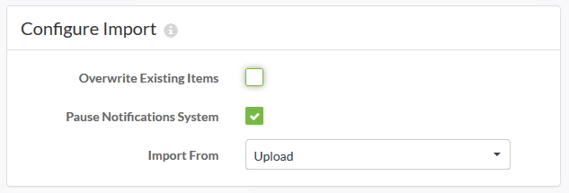
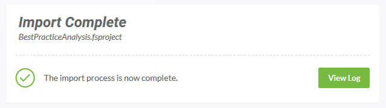

<!--Instructor Notes-->

<!--Exercise Section-->

<table style="border-spacing: 0px;border-collapse: collapse;font-family:serif">
<tr>
<td width=25% style="vertical-align:middle;background-color:darkorange;border: 2px solid darkorange">
<i class="fa fa-cogs fa-lg fa-pull-left fa-fw" style="color:white;padding-right: 12px;vertical-align:text-top"></i>
Exercise 1
</td>
<td style="border: 2px solid darkorange;background-color:darkorange;color:white">
Best Practice Workspace Analysis Project
</td>
</tr>

<tr>
<td style="border: 1px solid darkorange; font-weight: bold">Data</td>
<td style="border: 1px solid darkorange">Workspace Files</td>
</tr>

<tr>
<td style="border: 1px solid darkorange; font-weight: bold">Overall Goal</td>
<td style="border: 1px solid darkorange">Import and Export an FME Server Project</td>
</tr>

<tr>
<td style="border: 1px solid darkorange; font-weight: bold">Demonstrates</td>
<td style="border: 1px solid darkorange">FME Server Projects</td>
</tr>

<tr>
<td style="border: 1px solid darkorange; font-weight: bold">Start Workspace</td>
<td style="border: 1px solid darkorange">N/A</td>
</tr>

<tr>
<td style="border: 1px solid darkorange; font-weight: bold">End Workspace</td>
<td style="border: 1px solid darkorange">N/A</td>
</tr>

</table>

---

Best Practice is a very important concept for FME workspaces. To encourage colleagues to carry out best practices you wish to install a project that allows workspaces to be analyzed.

 **1) Browse To Projects**
 Open the FME Server web interface and log in with an account that has administrator privileges.

Select Projects on the main menu to browse to the Projects page:

 **2) Import Project**
 Click on the Import button to open the Configure Import dialogs:

In the Configure Import section, be sure to set the import to be by an upload:

*Overwrite Existing Items* is less important because the project should not yet exist for items to need overwriting. Similarly, *Pause Notifications System* is not important because it's very unlikely the notifications in the project will be triggered immediately (they are for handling incoming emails).

Click the Upload File button and browse to/select the file C:\FMEData2017\Resources\CodeSmellsWorkshop\BestPracticeAnalysis.fsproject

The project will very quickly be imported:

  

 **3) Check Log**
 Click the View Log button in order to examine the Backup/Restore log (which is where project imports are documented). A successful import will look something like this (some columns removed for brevity):

<pre>
Wed-07-Jun-2017 01:38:28 PM INFORM: (Migration) Received a configuration package for import.
Wed-07-Jun-2017 01:38:28 PM INFORM: (Migration) Unzipping configuration package...
Wed-07-Jun-2017 01:38:28 PM INFORM: (Migration) Upgrading configuration package schema version...
Wed-07-Jun-2017 01:38:29 PM INFORM: (Migration) Importing configuration package content to server...
Wed-07-Jun-2017 01:38:33 PM INFORM: (Migration) Imported configuration package successfully.
</pre>

 **4) Check Components**
 Now let's check for some of the components that should have been imported.

Click Projects on the menu again, and select the recently imported project. You should now see a list of the imported contents:

Use the menu options to check the Repository, Notifications, and Resources pages to ensure that the imported components do really exist.

![](./Images/

<!--Exercise Congratulations Section--> 

<table style="border-spacing: 0px">
<tr>
<td style="vertical-align:middle;background-color:darkorange;border: 2px solid darkorange">
<i class="fa fa-thumbs-o-up fa-lg fa-pull-left fa-fw" style="color:white;padding-right: 12px;vertical-align:text-top"></i>
CONGRATULATIONS
</td>
</tr>

<tr>
<td style="border: 1px solid darkorange">

By completing this exercise you have learned how to:
 
<ul><li>Create a new Publication</li>
<li>Create a new Topic as part of the Create Publication process</li>
<li>Use Directory Watch to trigger Topics and Notifications</li>
<li>Test a Publication and Topic using Topic Monitoring</li></ul>

</td>
</tr>
</table>   
