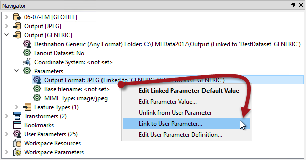

<!--Instructor Notes-->

<!--Exercise Section-->

<table style="border-spacing: 0px;border-collapse: collapse;font-family:serif">
<tr>
<td width=25% style="vertical-align:middle;background-color:darkorange;border: 2px solid darkorange">
<i class="fa fa-cogs fa-lg fa-pull-left fa-fw" style="color:white;padding-right: 12px;vertical-align:text-top"></i>
Exercise 3
</td>
<td style="border: 2px solid darkorange;background-color:darkorange;color:white">
Data Download System: Format and Coordinate Systems
</td>
</tr>

<tr>
<td style="border: 1px solid darkorange; font-weight: bold">Data</td>
<td style="border: 1px solid darkorange">Orthophoto images (GeoTIFF)</td>
</tr>

<tr>
<td style="border: 1px solid darkorange; font-weight: bold">Overall Goal</td>
<td style="border: 1px solid darkorange">Create an FME Server Data Download system for orthophotos</td>
</tr>

<tr>
<td style="border: 1px solid darkorange; font-weight: bold">Demonstrates</td>
<td style="border: 1px solid darkorange">Controlling output format and coordinate system in Data Download</td>
</tr>

<tr>
<td style="border: 1px solid darkorange; font-weight: bold">Start Workspace</td>
<td style="border: 1px solid darkorange">C:\FMEData2018\Workspaces\ServerAuthoring\SelfServe2-Ex3-Begin.fmw</td>
</tr>

<tr>
<td style="border: 1px solid darkorange; font-weight: bold">End Workspace</td>
<td style="border: 1px solid darkorange">C:\FMEData2018\Workspaces\ServerAuthoring\SelfServe2-Ex3-Complete.fmw</td>
</tr>

</table>

---

As a technical analyst in the GIS department of a city you have just commenced a project to allow other departments to download orthophoto data, rather than having to ask you to create it for them. Not only will their requests be processed quicker, you will also spend less time on that task.

So far you have created a simple workspace to translate orthophotos to JPEG format, added published parameters for transformation, and published it to a Data Download service on FME Server.

Now you need to give the end-users control over the output format and output coordinate system.

 **1) Open Workspace**
 Open the workspace from exercise 2, or the begin workspace listed above. You can see that it consists of a reader, a writer, and two transformers, plus some published parameters.

In this step we'll give the end-user control over format and coordinate system.

 **2) Add Writer**
 To give control over format you need a Generic format writer. Select Writers &gt; Add Writer from the menubar. When prompted enter these parameters:

<table style="border: 0px">

<tr>
<td style="font-weight: bold">Writer Format</td>
<td style="">Generic (Any Format)</td>
</tr>

<tr>
<td style="font-weight: bold">Writer Dataset</td>
<td style="">C:\FMEData2018\Output</td>
</tr>

<tr>
<td style="font-weight: bold">Writer Parameters</td>
<td style="">Output Format: JPEG (Joint Photographic Experts Group) MIME Type: image/jpeg</td>
</tr>

<tr>
<td style="font-weight: bold">Add Feature Types</td>
<td style="">Copy From Reader</td>
</tr>

</table>

The MIME type setting doesn't apply for a Data Download service, but we'll set it anyway. It can't hurt. Your workspace will now look like this:

The unconnected feature type belongs to the Generic Writer.

 **3) Switch Feature Types**
 We want to write to the Generic Writer, not the JPEG Writer, so switch the connection from the JPEG feature type to the Generic feature type. They are both labelled with the same name, so be sure to inspect their properties to check if you need to. You could (should?) also add an annotation to each, to tell them apart.

Don't delete the JPEG Writer though, or its feature type. We'll need those for reasons to be explained shortly.

 **4) Create User Parameter**
 To give control over format requires a published parameter. So in the Navigator window of FME Workbench, locate the section marked User Parameters. Right-click on there and choose the option Add Parameter.

Set the parameter values as follows:

<table>
<tr><td style="font-weight: bold">Type</td><td>Choice with Alias</td></tr>
<tr><td style="font-weight: bold">Name</td><td>OutputFormat</td></tr>
<tr><td style="font-weight: bold">Published</td><td>Yes</td></tr>
<tr><td style="font-weight: bold">Optional</td><td>No</td></tr>
<tr><td style="font-weight: bold">Prompt</td><td>Select the Output Format</td></tr>
</table>

For the configuration field, click the [...] browse button. In the dialog that opens, click on Import &gt; Writer Format(s):

This will open a list of FME-supported formats. Choose a few simple raster formats such as JPEG, PNG, and GeoTIFF. Click OK to close the dialog and return to the previous one:

---

<!--Warning Section-->

<table style="border-spacing: 0px">
<tr>
<td style="vertical-align:middle;background-color:darkorange;border: 2px solid darkorange">
<i class="fa fa-exclamation-triangle fa-lg fa-pull-left fa-fw" style="color:white;padding-right: 12px;vertical-align:text-top"></i>
WARNING
</td>
</tr>

<tr>
<td style="border: 1px solid darkorange">

Be sure to use the PNG format called PNGRASTER. Don't select the format called PNG Rasterizer (PNG) as that is for rasterizing vector data, not writing raster data.

</td>
</tr>
</table>

---

Click OK and OK again to close these dialogs and create the parameter.

 **5) Apply User Parameter**
 Now that we've created a user parameter, we have to apply it.

Locate the Generic Writer in the Navigator window, expand its parameters and locate the parameter called Output Format. This is already linked to a published parameter that FME created automatically, but we want to ignore that and use our own.

So, right-click on Output Format and choose the option to Link to User Parameter:

When prompted select the OutputFormat parameter that we just created:

The parameter FME created (GENERIC_OUT_FORMAT_GENERIC) will be automatically deleted. FME realizes that we don't need it any more and, since it is used nowhere else, will remove it.

***NB:** If you didn't set a default value for the OutputFormat user parameter, then the Generic writer parameter will turn red (flagged as incomplete). This is nothing to worry about. It will be set at runtime.*

 **6) Create User Parameter**
 The next parameter required is to give control over output coordinate system. The process is very similar to that of format. In the Navigator window of FME Workbench, locate the section marked User Parameters. Right-click on there and choose the option Add Parameter.

Set the parameter values as follows:

<table>
<tr><td style="font-weight: bold">Type</td><td>Choice with Alias</td></tr>
<tr><td style="font-weight: bold">Name</td><td>OutputCoordSys</td></tr>
<tr><td style="font-weight: bold">Published</td><td>Yes</td></tr>
<tr><td style="font-weight: bold">Optional</td><td>No</td></tr>
<tr><td style="font-weight: bold">Prompt</td><td>Select the Output Coordinate System</td></tr>
</table>

For the configuration field, click the [...] browse button. In the dialog that opens, click on Import &gt; Coordinate System(s). This opens a list of FME coordinate systems. Choose a few simple systems that will apply to this part of Canada, such as LL84, BCALB-83, and UTM83-10.

Click OK to close the dialog and return to the previous one:

Click OK and OK again to close these dialogs and create the parameter.

 **7) Apply User Parameter**
 Once more, now that we've created a user parameter, we have to apply it.

Locate the Generic Writer in the Navigator window, and this time look for the parameter called Coordinate System:

Right-click on this parameter and choose Link to User Parameter. When prompted, select the published parameter called OutputCoordSys that we just created.

If you now use the Run button in Workbench you'll see that both these parameters are now published.

 **8) Publish to FME Server**
 Save the workspace and publish it to FME Server. **However!** When you register it with the Data Download service be sure to click the Edit button to edit the service properties. In that dialog you MUST set the writer to "Output [GENERIC]" (not "Output [JPEG]").

If you don't do that, then the Data Download will consist of the output of the JPEG Writer. Since that is not connected, there will be no output and so no zip file!

Once published locate the workspace in the FME Server web interface and run it.

Choose different options for output format and coordinate system to see what happens in the output.

---

<!--Person X Says Section-->

<table style="border-spacing: 0px">
<tr>
<td style="vertical-align:middle;background-color:darkorange;border: 2px solid darkorange">
<i class="fa fa-quote-left fa-lg fa-pull-left fa-fw" style="color:white;padding-right: 12px;vertical-align:text-top"></i>
Professor Spatial F.M.E., E.T.L. says...
</td>
</tr>

<tr>
<td style="border: 1px solid darkorange">

Right now I imagine you have some questions!
  <strong>Q) Why didn't we delete the original JPEG Writer when we added the Generic Writer?</strong>
 A) It's because we have a parameter published for JPEG compression. If we deleted the JPEG Writer we would no longer have access to that parameter.
  <strong>Q) But we're not even using the JPEG Writer anymore, so how would that parameter work?</strong>
 A) Because the Generic Writer picks up parameters for the format it is writing from any Writer of that format! So you could add a dummy PNG format Writer and the Generic Writer would use the dummy's parameters when writing PNG.

</td>
</tr>
</table>

---

<!--Exercise Congratulations Section-->

<table style="border-spacing: 0px">
<tr>
<td style="vertical-align:middle;background-color:darkorange;border: 2px solid darkorange">
<i class="fa fa-thumbs-o-up fa-lg fa-pull-left fa-fw" style="color:white;padding-right: 12px;vertical-align:text-top"></i>
CONGRATULATIONS
</td>
</tr>

<tr>
<td style="border: 1px solid darkorange">

By completing this exercise you have learned how to:
 
<ul><li>Add a Generic Writer and set up its format and MIME type parameters</li>
<li>Create an output format user parameter and apply it to a Generic Writer</li>
<li>Create an output coordinate system user parameter and apply it to a Generic Writer</li>
<li>Apply a parameter from a dummy Writer to the generic Writer</li></ul>

</td>
</tr>
</table>   
