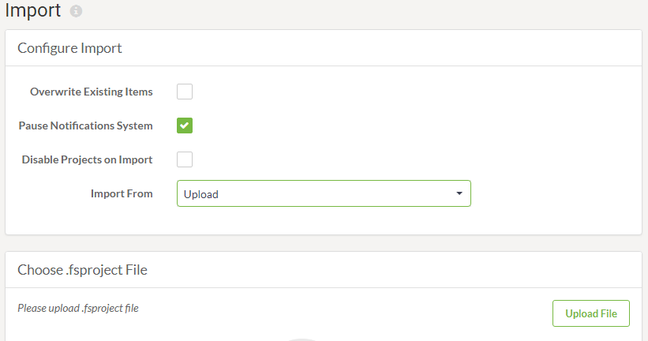

## Importing a Project ##

Importing a project is - like exporting - carried out on the Projects page. This is done by simply clicking the Import button.

The Import page allows a .fsproject file to be uploaded or read from a folder in Resources. It also includes other parameters to control the import:

