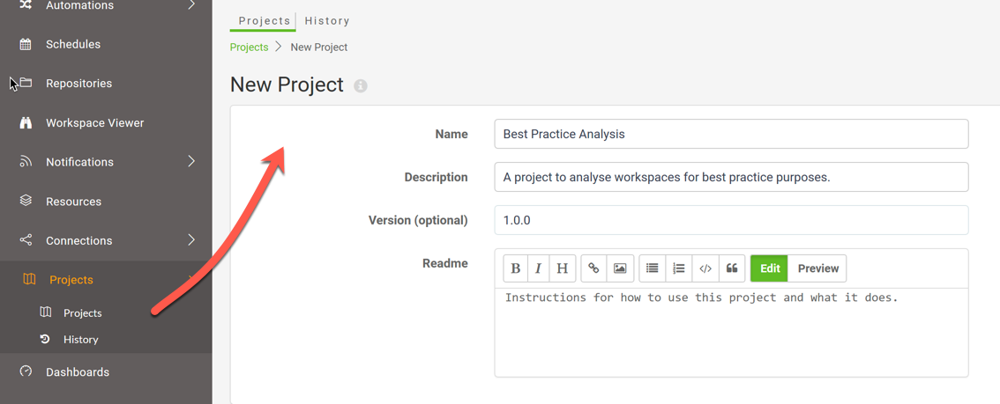
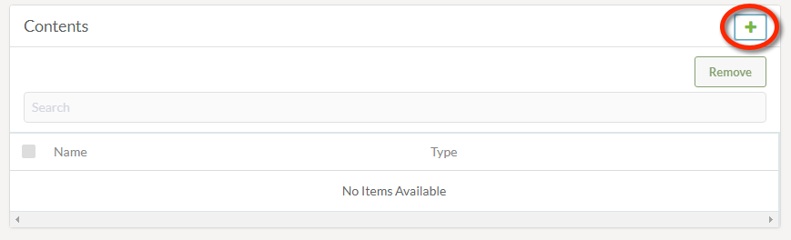
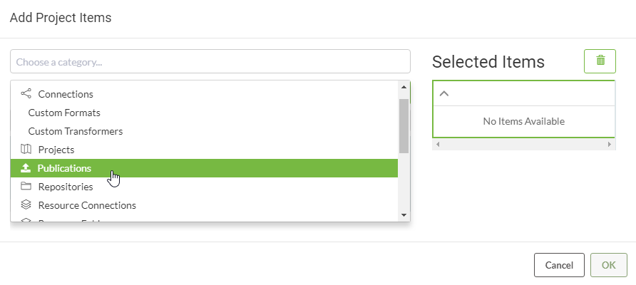
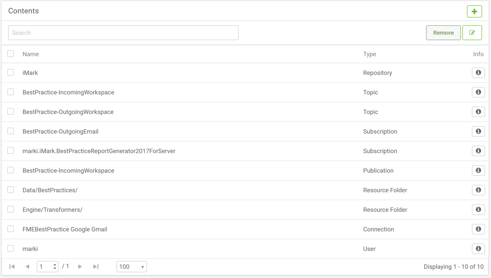
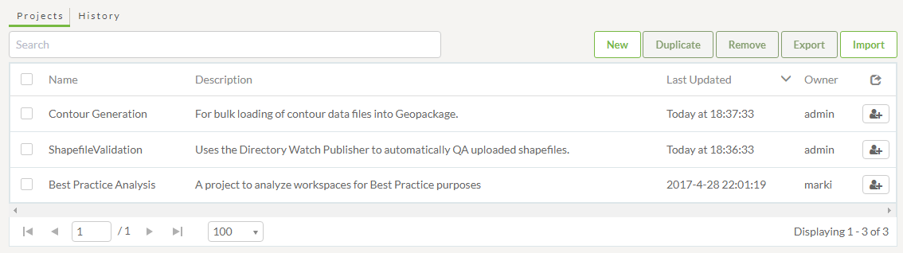

# Creating a Project

Creating a project involves initiating the creation process and then simply adding the required components to that project.

## Create Project ##

Creating a project is carried out on the Projects page (accessed via the main menu) by clicking the New button and entering some basic project settings such as Name and Description:

Below the Project Settings is a dialog that shows all content currently added to the project (if any) with a button to add new items on the right-hand side:

Clicking on the '+' button opens the Add Project Items dialog which allows components to be added to the project:

Once you have added some items to the project, they will be listed under the Contents dialog:

Once complete the project is added to the list on the Projects landing page:

