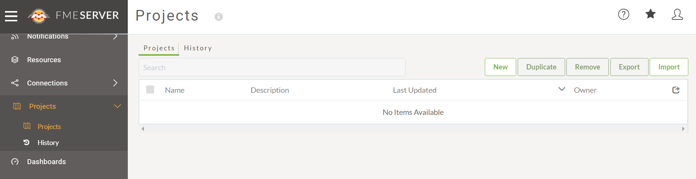
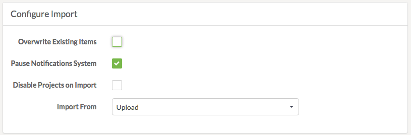
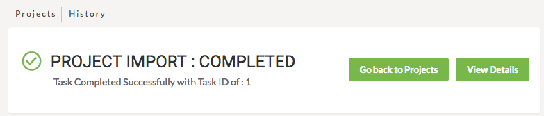
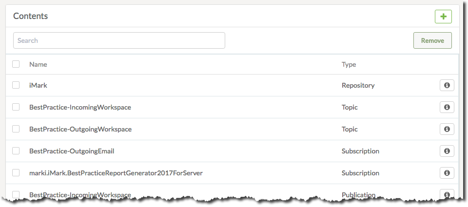
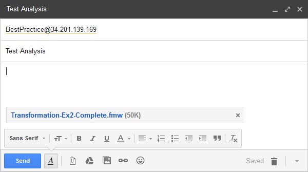
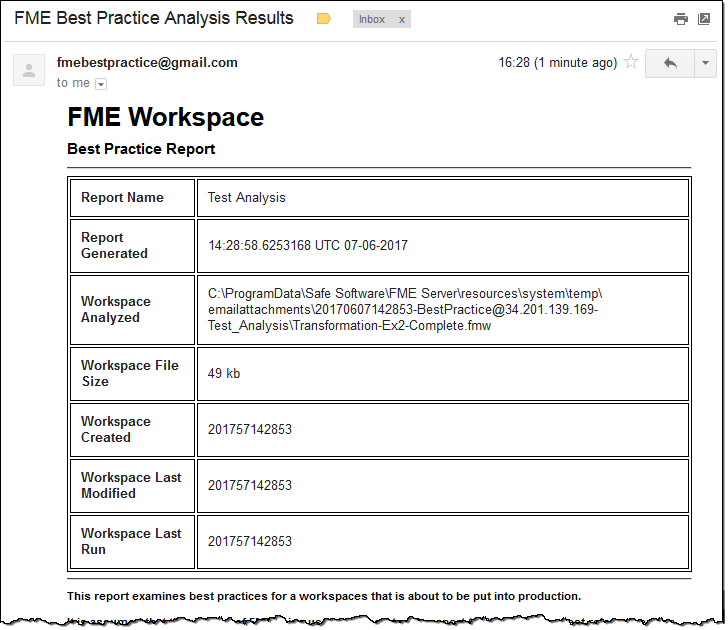

<!--Instructor Notes-->

<!--Exercise Section-->

<table style="border-spacing: 0px;border-collapse: collapse;font-family:serif">
<tr>
<td width=25% style="vertical-align:middle;background-color:darkorange;border: 2px solid darkorange">
<i class="fa fa-cogs fa-lg fa-pull-left fa-fw" style="color:white;padding-right: 12px;vertical-align:text-top"></i>
Exercise 1
</td>
<td style="border: 2px solid darkorange;background-color:darkorange;color:white">
Best Practice Workspace Analysis Project
</td>
</tr>

<tr>
<td style="border: 1px solid darkorange; font-weight: bold">Data</td>
<td style="border: 1px solid darkorange">Workspace Files</td>
</tr>

<tr>
<td style="border: 1px solid darkorange; font-weight: bold">Overall Goal</td>
<td style="border: 1px solid darkorange">Import an FME Server Project</td>
</tr>

<tr>
<td style="border: 1px solid darkorange; font-weight: bold">Demonstrates</td>
<td style="border: 1px solid darkorange">FME Server Projects</td>
</tr>

<tr>
<td style="border: 1px solid darkorange; font-weight: bold">Start Workspace</td>
<td style="border: 1px solid darkorange">N/A</td>
</tr>

<tr>
<td style="border: 1px solid darkorange; font-weight: bold">End Workspace</td>
<td style="border: 1px solid darkorange">N/A</td>
</tr>

</table>

---

Best Practice is a very important concept for FME workspaces. To encourage colleagues to carry out best practices you wish to install a project that allows workspaces to be analyzed.

 **1) Browse To Projects**
 Open the FME Server web interface and log in with an account that has administrator privileges.

Select Projects on the main menu to browse to the Projects page:

 **2) Import Project**
 Click on the Import button to open the Import page:

Under the Configure Import section, be sure to set the import to be from an upload:

*Overwrite Existing Items* is less important because the project should not yet exist for items to need overwriting. Similarly, *Pause Notifications System* is not important because it's very unlikely the notifications in the project will be triggered immediately (they are for handling incoming emails).

Click the Upload File button and browse to/select the file C:\FMEData2018\Resources\CodeSmellsWorkshop\BestPracticeAnalysis.fsproject

The project will very quickly be imported:

  

 **3) Check Log**
 Click the View Details button in order to examine the Project Import log. A successful import will look something like this:

---

<!--Tip Section-->

<table style="border-spacing: 0px">
<tr>
<td style="vertical-align:middle;background-color:darkorange;border: 2px solid darkorange">
<i class="fa fa-info-circle fa-lg fa-pull-left fa-fw" style="color:white;padding-right: 12px;vertical-align:text-top"></i>
TIP
</td>
</tr>

<tr>
<td style="border: 1px solid darkorange">

The history page under projects will show a full history of all projects that have been imported to the system.

</td>
</tr>
</table>

---

 **4) Check Components**
 Now let's check for some of the components that should have been imported.

Click Projects on the menu again, and select the recently imported project. You should now see a list of the imported contents:

Use the menu options to check the Repository, Notifications, and Resources pages to ensure that the imported components do really exist.

 **5) Test Project**
 Now let's send an email to your FME Server to test the project. This assumes that you are using a server that has a public name, domain, or address.

For FME Server on one of Safe's training computers, the public IP address is shown on the top-right of the desktop, or within the readme file obtained when you started the computer:

The email address will be BestPractice@xxxx, where xxxx is the IP address:

Set a subject line and attach a workspace file. Click the Send button. In response (it may take a minute or two) you will receive an email report about the best practices used in that workspace:

This demonstrates that the project has been imported and set up correctly.

 **6) Clean Up Project**
 One part of the project that is not needed is a user account.

So, return to the project contents, select the marki User, and remove it.

This will remove the account from the project, but since the project has already been imported, the account will also exist on the machine. So also go to the Security > Users page and remove that user.

Send another email to confirm that the project is still working.

 **7) Export Project**
 Now the project has been updated, export it so that it can be imported in its proper form elsewhere.

To do so, browse to the Projects page, select the project (using the checkbox on the left), and click the Export button.

In the dialog that opens you can choose whether to save the project file to a download or a resources folder. Once complete the following message will appear:

---

<!--Exercise Congratulations Section-->

<table style="border-spacing: 0px">
<tr>
<td style="vertical-align:middle;background-color:darkorange;border: 2px solid darkorange">
<i class="fa fa-thumbs-o-up fa-lg fa-pull-left fa-fw" style="color:white;padding-right: 12px;vertical-align:text-top"></i>
CONGRATULATIONS
</td>
</tr>

<tr>
<td style="border: 1px solid darkorange">

By completing this exercise you have learned how to:
 
<ul><li>Import a Project</li>
<li>Check the Project History and confirm a Project was successfully imported</li>
<li>Edit a Project's contents</li>
<li>Export a Project</li></ul>

</td>
</tr>
</table>   
