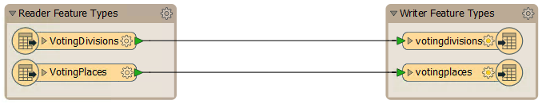
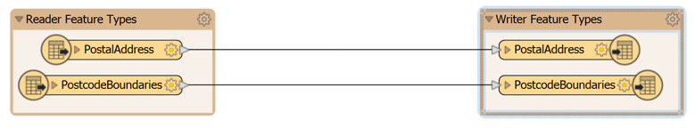
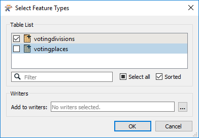
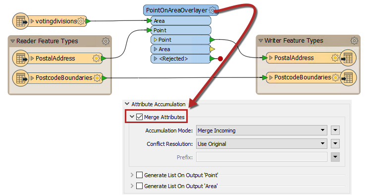
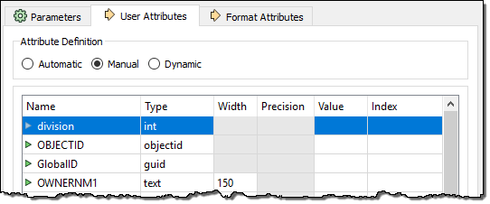
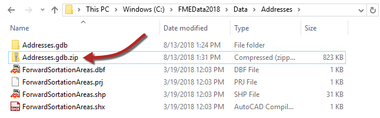
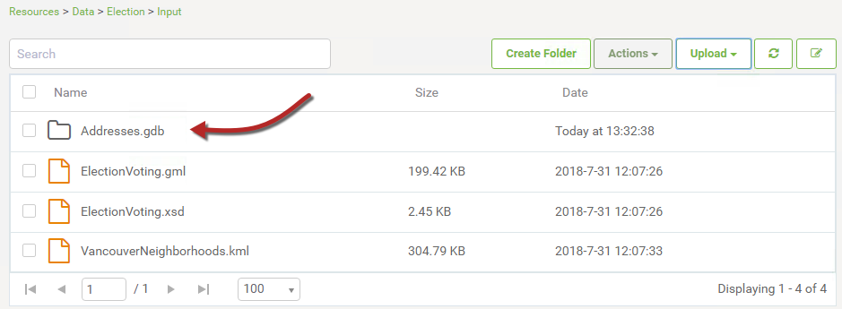
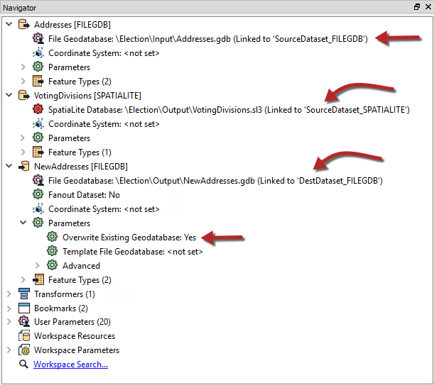
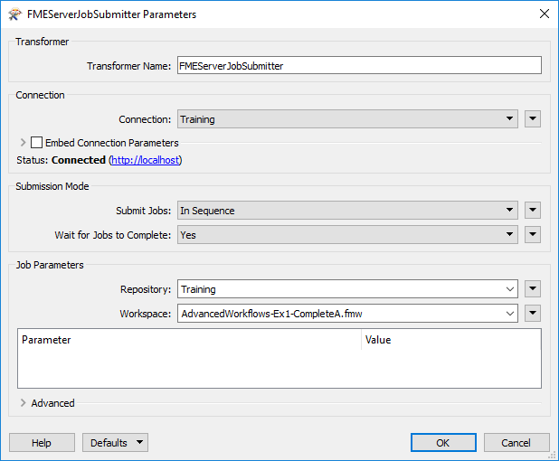
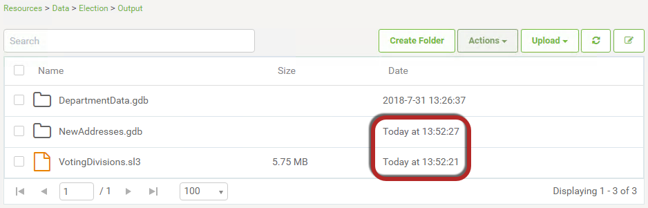

<!--Instructor Notes-->

<!--Exercise Section-->

<table style="border-spacing: 0px;border-collapse: collapse;font-family:serif">
<tr>
<td width=25% style="vertical-align:middle;background-color:darkorange;border: 2px solid darkorange">
<i class="fa fa-cogs fa-lg fa-pull-left fa-fw" style="color:white;padding-right: 12px;vertical-align:text-top"></i>
Exercise 6.2
</td>
<td style="border: 2px solid darkorange;background-color:darkorange;color:white">
Authoring Workspace Chains
</td>
</tr>

<tr>
<td style="border: 1px solid darkorange; font-weight: bold">Data</td>
<td style="border: 1px solid darkorange">Voting Divisions (GML (Geography Markup Language)) Addresses (Esri Geodatabase (File Geodb API))</td>
</tr>

<tr>
<td style="border: 1px solid darkorange; font-weight: bold">Overall Goal</td>
<td style="border: 1px solid darkorange">Create workspaces to: - process voting divisions - to assign voting divisions to addresses - to chain the previous two translations together</td>
</tr>

<tr>
<td style="border: 1px solid darkorange; font-weight: bold">Demonstrates</td>
<td style="border: 1px solid darkorange">Authoring workspace chains</td>
</tr>

<tr>
<td style="border: 1px solid darkorange; font-weight: bold">Start Workspace</td>
<td style="border: 1px solid darkorange">None</td>
</tr>

<tr>
<td style="border: 1px solid darkorange; font-weight: bold">End Workspace</td>
<td style="border: 1px solid darkorange">C:\FMEData2018\Workspaces\ServerAuthoring\AdvancedWorkflows-Ex2-CompleteA.fmw C:\FMEData2018\Workspaces\ServerAuthoring\AdvancedWorkflows-Ex2-CompleteB.fmw C:\FMEData2018\Workspaces\ServerAuthoring\AdvancedWorkflows-Ex2-CompleteC.fmw</td>
</tr>

</table>

---

You're a technical analyst in the GIS department of your local city. You have plenty of experience using FME Desktop, and your department has just purchased FME Server.

A municipal election is about to happen, and Elections Interopolis have provided a dataset of new voting divisions in GML format. Your first task today is to create a workspace to translate these voting divisions to a SpatiaLite database format for use within the city and write the data to a resources folder on FME Server so that everyone can use it.

Coincidentally, the planning department heard of this update and has asked you to assign voting division IDs to each of the records in the city's address database, for use in election planning.

You realize that you can chain these two translations together to execute consecutively under a master workspace. So in all, you have three workspaces to create!

---

 **1) Start FME Workbench**
 Start FME Workbench and generate a translation with these parameters:

<table style="border: 0px">

<tr>
<td style="font-weight: bold">Reader Format</td>
<td style="">GML (Geography Markup Language)</td>
</tr>

<tr>
<td style="font-weight: bold">Reader Dataset</td>
<td style="">C:\FMEData2018\Data\Elections\ElectionVoting.gml</td>
</tr>

<tr>
<td style="font-weight: bold">Writer Format</td>
<td style="">SpatiaLite</td>
</tr>

<tr>
<td style="font-weight: bold">Writer Dataset</td>
<td style=""></td>
</tr>

</table>

The Writer dataset can be left empty for now. When prompted, leave both source feature types (layers) selected.

 **2) Create Resources**
 We'll handle the input and output of this workspace using the resources folders on FME Server. So, log in to the FME Server web interface and navigate to the Resources page.

If you carried out exercise 1.4, then you should already have a folder Resources\Data\Election\Input containing the source data used in the workspace.

If not, create that set of folders and subfolders. Upload the source GML dataset to the Input folder (you should upload both the .gml and .xsd files):

 **3) Edit Workspace to use Resources**
 Back in FME Workbench look in the Navigator window under User Parameters for the two existing published parameters called SourceDataset&#95;GML and DestDataset&#95;SPATIALITE. Click on each in turn and press the delete key to delete them.

Next locate the parameters for the GML source dataset and SpatiaLite destination dataset. Update the parameters to read as follows:

<table>
<tr><td>GML Reader</td><td>$(FME&#95;SHAREDRESOURCE&#95;DATA)\Election\Input\ElectionVoting.gml</td></tr>
<tr><td>SpatiaLite Writer</td><td>$(FME&#95;SHAREDRESOURCE&#95;DATA)\Election\Output\VotingDivisions.sl3</td></tr>
</table>

One final tweak: change the Writer parameter Overwrite Existing Database to Yes

 **4) Save, Publish, and Run Workspace**
 Save the workspace (to something like AdvancedWorkflows-Ex2-CompleteA.fmw) and remember the filename: it will be important later. Publish the workspace to FME Server. It should be registered with the Job Submitter service.

Locate the workspace in the Server web interface and run it to make sure it runs to completion. The evidence of success will be the log and an sl3 file in the resources folder.

Select the sl3 dataset and click on Actions > Download to download the file. This is important; we'll need the file to set up our next workspace.

Save the file to the Elections folder, so you will remember where it is; i.e., C:\FMEData2018\Data\Elections\VotingDivisions.sl3

 **5) Generate Workspace**
 That was the first workspace in our project. Now for the second.

Open Workbench if necessary and generate a new workspace with these parameters:

<table style="border: 0px">

<tr>
<td style="font-weight: bold">Reader Format</td>
<td style="">Esri Geodatabase (File Geodb Open API)</td>
</tr>

<tr>
<td style="font-weight: bold">Reader Dataset</td>
<td style="">C:\FMEData2018\Data\Addresses\Addresses.gdb</td>
</tr>

<tr>
<td style="font-weight: bold">Writer Format</td>
<td style="">Esri Geodatabase (File Geodb Open API)</td>
</tr>

<tr>
<td style="font-weight: bold">Writer Dataset</td>
<td style="">C:\FMEData2018\Output\Training\NewAddresses.gdb</td>
</tr>

</table>

When prompted, leave both source feature types (tables) selected.

 **6) Add Reader**
 To assign voting divisions we need to have that data in our workspace. So, select Readers &gt; Reader from the menubar and add a reader to read the downloaded VotingDivisions SpatiaLite database:

<table style="border: 0px">

<tr>
<td style="font-weight: bold">Reader Format</td>
<td style="">SpatiaLite</td>
</tr>

<tr>
<td style="font-weight: bold">Reader Dataset</td>
<td style="">C:\FMEData2018\Data\Elections\VotingDivisions.sl3</td>
</tr>

</table>

***NB:*** *If you can't find that sl3 file, go back to step 4 and make sure you downloaded the result of the first workspace.*

When prompted, select only the source feature type (table) *votingdivisions*.

 **7) Add Transformer**
 Now let's add a transformer to assign voting divisions to each address. Place a PointOnAreaOverlayer transformer into the workspace. Connect it as follows:

 

- **Delete Connection**: Geodatabase:PostalAddress &gt; Geodatabase:PostalAddress
- **Add Connection:** Geodatabase:PostalAddress &gt; PointOnAreaOverlayer:Point
- **Add Connection:** SpatiaLite:votingdivisions &gt; PointOnAreaOverlayer:Area
- **Add Connection:** PointOnAreaOverlayer:Point &gt; Geodatabase:PostalAddress

 Then open the parameters for the PointOnAreaOverlayer, expand the section Attribute Accumulation, and check Merge Attributes. The default settings are fine as they are. This will add the attributes from votingdivisions to PostalAddress.

 **8) Edit Writer Schema**
 The PointOnAreaOverlayer will copy the division attribute on to each address, but that attribute won't be written unless we also add it to the output schema.

So, inspect the parameters for the writer feature type PostalAddress. In the User Attributes tab add a new attribute called division (of type int):

*division* is case-sensitive since we want it to match what is coming in from the *votingdivisions* table.

 **9) Test Run Workspace**
 Before we start adjusting the dataset paths for use on FME Server, run the workspace to ensure it produces the correct output; i.e., that each address now has a division attribute.

 **10) Create Resources**
 We'll also handle the input and output of this workspace using the resources folders on FME Server.

Firstly, we can upload a File Geodatabase as a folder/file only if we're using the Chrome web browser. Just in case you aren't, locate the source Geodatabase in your file system and compress it into a single zip file:

Next, upload the Addresses.gdb folder (or addresses.gdb.zip) to the Resources > Data > Election > Input folder on FME Server:

 **11) Edit Workspace to use Resources**
 Back in FME Workbench look in the Navigator window under User Parameters for the three existing published parameters called SourceDataset&#95;FILEGDB, SourceDataset&#95;SPATIALITE, and DestDataset&#95;SPATIALITE. Click on each in turn and press the delete key to delete them.

Next locate the parameters for the Geodatabase source dataset, SpatiaLite source dataset, and Geodatabase destination dataset. Update the parameters to read as follows:

<table>
<tr><td>Geodatabase Reader</td><td>$(FME&#95;SHAREDRESOURCE&#95;DATA)\Election\Input\Addresses.gdb.zip</td></tr>
<tr><td>SpatiaLite Reader</td><td>$(FME&#95;SHAREDRESOURCE&#95;DATA)\Election\Output\VotingDivisions.sl3</td></tr>
<tr><td>Geodatabase Writer</td><td>$(FME&#95;SHAREDRESOURCE&#95;DATA)\Election\Output\NewAddresses.gdb.zip</td></tr>
</table>

**Note:** If you uploaded the Addresses.gdb as a zip file, add .zip at the end of the parameter for both the Geodatabase Reader and Writer.

One final tweak: change the Writer parameter Overwrite Geodatabase to Yes:

 **12) Save, Publish, and Run Workspace**
 Save the workspace (to something like AdvancedWorkflows-Ex2-CompleteB.fmw) and remember the filename: it will be important later. Publish the workspace to FME Server. It should be registered with the Job Submitter service.

Locate the workspace in the Server web interface and run it to make sure it runs to completion. The evidence of success will be the log and a zipped geodatabase file in the resources folder.

You may wish to download the newly created dataset to inspect it and make sure the output is correct; i.e., that each address now has a division attribute.

 **13) Create Workspace**
 That was the second workspace in our project. Now for the third and final workspace. This workspace will be used to chain the previous two workspaces. It is going to be the master, with the two prior workspaces as children.

So, open Workbench and start with an empty canvas. Place a Creator transformer followed by two FMEServerJobSubmitter transformers:

 **14) Set Parameters**
 Inspect the parameters for the first of the FMEServerJobSubmitter transformers.

Firstly, select your FME Server connection. Then, under Submission Mode, set Wait for Jobs to Complete to Yes. If we didn't do this then the second job submitter transformer would run before the first had finished!

Finally, select the Training repository and the first of the two prior workspaces (the one that converted election divisions from GML to SpatiaLite).

Below is an area where we can set the parameters for the translation. However, since there are no published parameters, we don't need to worry about that.

Click OK to close the dialog.

Notice that the output ports on the transformer have changed now that we have set it to wait for the job to complete. Reconnect it to the other FMEServerJobSubmitter by dragging a connection from the Succeeded port to the input port on the second transformer.

Now repeat the same process for the second FMEServerJobSubmitter, this time selecting the second workspace (the one that did the overlay of addresses on divisions).

 **15) Save, Publish, and Run Workspace**
 Save the workspace (to something like AdvancedWorkflows-Ex2-CompleteC.fmw) and publish it to FME Server. It should be registered with the Job Submitter service.

Locate the workspace in the Server web interface and run it to make sure it runs to completion. It will run each of the two child workspaces in turn.

Don't worry that FME reports zero features written. That only refers to the master workspace (not the child workspaces). Evidence of success will be the log and new output files (sl3, gdb) in the resources folder:

Notice that the date/timestamps will be very similar for the two datasets; the VotingDivisions.sl3 file should be created first and then NewAddresses.gdb.zip shortly after.

---

<!--Person X Says Section-->

<table style="border-spacing: 0px">
<tr>
<td style="vertical-align:middle;background-color:darkorange;border: 2px solid darkorange">
<i class="fa fa-quote-left fa-lg fa-pull-left fa-fw" style="color:white;padding-right: 12px;vertical-align:text-top"></i>
Sister Intuitive says...
</td>
</tr>

<tr>
<td style="border: 1px solid darkorange">

As already mentioned there are many ways to set up chains and this is just one of them. The drawback of writing data to a fixed location (like here) is that someone might change the first workspace to write data to a different location, causing the second workspace to fail.

</td>
</tr>
</table>

---

<!--Exercise Congratulations Section-->

<table style="border-spacing: 0px">
<tr>
<td style="vertical-align:middle;background-color:darkorange;border: 2px solid darkorange">
<i class="fa fa-thumbs-o-up fa-lg fa-pull-left fa-fw" style="color:white;padding-right: 12px;vertical-align:text-top"></i>
CONGRATULATIONS
</td>
</tr>

<tr>
<td style="border: 1px solid darkorange">

By completing this exercise you have learned how to:
 
<ul><li>Create child workspaces that read and write resources datasets</li>
<li>Create a master workspace that runs the child workspaces using the FMEServerJobSubmitter</li></ul>

</td>
</tr>
</table>
